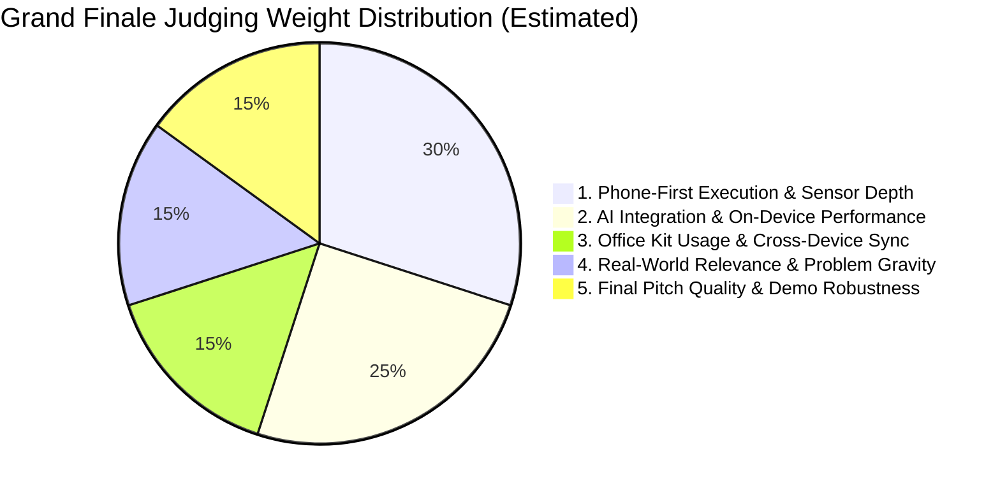
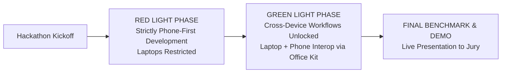

# 03_HACKATHON_RESEARCH.md
## iQOO Hackathon 2026 Grand Finale: Rules, Constraints, Tracks & Evaluation Framework

**Document Version**: 1.0  
**Event**: iQOO Hackathon 2026 Grand Finale  
**Location**: Bengaluru, India (Offline Event)  
**Host / Platform**: Reskilll & iQOO India (`https://iqoo.reskilll.com/dashboard/iqoo-finale`)  
**Official Announcement**: [iQOO Community Thread 167130](https://community.iqoo.com/in/thread/167130)  
**Target Device**: iQOO 15 Flagship (Qualcomm Snapdragon 8 Elite Gen 5 / OriginOS 6)  
**Date**: September 25, 2026

---

### 1. Official Hackathon Rules & Participation Eligibility

* **Team Structure & Composition Rules**:
  * Team Size: 1 to 3 members. Solo participation is permitted.
  * Category Isolation: Strict barrier between **Students** and **Working Professionals**. Teams cannot mix categories; all registered members of a team must belong to the exact same category.
  * Verified Team Registration: `HoloTrio` (Sanskar Tiwari - Leader; Shambhavi Patil - Member). Category: Registered on the Reskilll Finale Portal.
* **Competition Environment & Equipment**:
  * The Grand Finale is an in-person, 30+ hour physical hackathon in Bengaluru.
  * Organizers provide target hardware (**iQOO 15 smartphone**) to teams on-site for deployment, sensor testing, benchmarking, and judging demonstrations.

---

### 2. The 6 Official Grand Finale Tracks

From the official Reskilll Grand Finale portal and official visual materials (`iqoo.jpg` and `problem-statement.txt`):

| Track Name | Verbatim Official Description | Target Outcome & Solution Scope |
| :--- | :--- | :--- |
| **1. Mobility** | *"Build solutions for navigation, EVs, public transport, parking, or travel experiences."* | Precision routing, EV battery/thermal optimization, dead-reckoning navigation in GPS-denied zones (basements, tunnels), dynamic congestion/pothole mapping, public transit ticketing/occupancy tracking. |
| **2. Community App** | *"Build a community app, not specific to iQOO, that connects developers, professionals, or interest groups, with AI (preferred to be on device) at the core."* | Collaborative intelligence, localized peer-to-peer interest groups, secure offline data sharing, localized civic watchdog networks, developer knowledge graphs, edge federated knowledge pooling. |
| **3. Smart Living** | *"Design AI-powered solutions for smart homes, IoT, connected devices, or everyday convenience."* | Physical appliance interaction, ambient environment regulation, elderly/infant care monitoring, energy management, zero-cloud home automation utilizing onboard IR, NFC, Wi-Fi 7, and BLE. |
| **4. Productivity** | *"Build AI-powered solutions that help people work smarter, automate repetitive tasks, manage time and information, improve workflows, and get more done."* | On-device contextual memory, multimodal meeting intelligence, cross-application automation, autonomous mobile workflows, document and spatial diagram digitization without cloud latency. |
| **5. Developer Tools** | *"Build tools that help developers create, test, deploy, or collaborate faster using AI."* | Mobile debugging aids, hardware circuit inspection, real-time code execution/profiling, sensor telemetry capture and synthetic dataset generation, automated mobile QA testing. |
| **6. Open Innovation** | *"Anything outside the tracks, any domain, with a local or open source model at the core."* | Healthcare diagnostics, accessibility sensory substitution, agricultural field analysis, industrial safety, geodetic surveying, water/food quality testing, decentralized security. |

---

### 3. Submission Requirements & Deliverables

* **Phase 1 Idea Submission**:
  * **Deadline**: October 5, 2026 (Submitted via Reskilll Portal).
  * **Deliverables**: Detailed problem statement, architectural diagram, proposed hardware/sensor utilization plan, on-device AI runtime strategy, and expected impact.
* **Grand Finale Physical Submission (October 9–11, 2026)**:
  * **Functional Working Prototype**: An executable Android application (`.apk`) running natively on the physical iQOO 15 smartphone.
  * **Live Demonstration**: Mandatory real-time execution in front of judges demonstrating physical sensor intake, local AI inference, and output generation without simulation or video mocks.
  * **Presentation Deck**: Slide deck (PDF/PPT, typically 8–10 slides) covering Problem, Unfair Advantage / Hardware Synergy, Technical Architecture, Market Opportunity, and Live Demo.
  * **Source Code Repository**: Clean, documented Git repository containing Android Studio project files, native C++/NDK bindings, quantization scripts, and model assets.

---

### 4. Official Judging Criteria & The 5 Evaluation Pillars

Evaluations at the City Battles and the Grand Finale are structured around five distinct pillars:



1. **Phone-First Execution (Weight: ~30%)**:
   * *Core Question*: "Why does this solution need a smartphone — specifically an iQOO 15 — rather than a web app or cloud API?"
   * Depth of native sensor utilization: Cameras (Main + Periscope + Ultrawide), 6-axis IMU, Color Spectrum sensor, NavIC GNSS, Microphones, IR Blaster, NFC, and Display Co-processor Q3.
   * Disqualification of generic wrappers: Apps that merely display a chatbot UI talking to a remote server receive near-zero scores under this pillar.
2. **AI Integration (Weight: ~25%)**:
   * Strong, explicit preference for **on-device / local / open-source models** running on the Qualcomm Snapdragon 8 Elite Hexagon NPU.
   * Model quantization quality (INT4/INT8 via LiteRT, QNN SDK, or ONNX Runtime Mobile).
   * Verified offline inference capability (zero cloud dependency during flight mode).
   * Inference latency, thermal footprint, and memory efficiency.
3. **Office Kit Usage (Weight: ~15%)**:
   * Formal requirement evaluating how teams bridge the phone to workstations or external displays using the preinstalled **vivo/iQOO Office Kit**.
   * Evaluates cross-device screen mirroring, shared clipboard synchronization, wireless drag-and-drop file transfers, and multi-screen monitoring.
4. **Real-World Relevance & Practical Impact (Weight: ~15%)**:
   * Severity and economic significance of the problem being solved.
   * Viability of real-world adoption, regulatory feasibility, and user privacy protection.
5. **Final Pitch Quality & Live Demo Robustness (Weight: ~15%)**:
   * Flawless live execution without crashes or fallback excuses.
   * Clarity of the 2-minute pitch and technical defense during judge Q&A.

---

### 5. Competition Mechanics: Red Light vs. Green Light Rules

A hallmark innovation of the iQOO Hackathon format is the dynamic phase shifting during the 30-hour sprint:



* **The Red Light Phase**:
  * **Constraint**: Participants are restricted from traditional laptop-based development. Development, prototyping, and testing must be conducted **directly on the iQOO 15 smartphone**.
  * **Architectural Implication**: Forces teams to design applications that leverage the phone's native compute, on-device AI runtimes (LiteRT, MediaPipe Tasks, ONNX Runtime), and onboard sensors, rather than relying on heavy cloud backends.
  * **Permitted Tools**: On-device IDEs (AIDE, Termux with native toolchains, mobile code editors), local APK installation, and mobile debugging interfaces.
* **The Green Light Phase**:
  * **Constraint Lifted**: Full cross-device workflows are unlocked. Laptops can be connected to the phone.
  * **Focus**: Teams use laptops for heavy model training/quantization (PyTorch to QNN / ONNX conversion), complex backend integrations, dashboard packaging, and slide preparation.
  * **Interoperability Requirement**: Teams are expected to utilize **vivo/iQOO Office Kit** to sync assets, mirror phone screens onto monitor displays, and showcase dual-screen operations.

---

### 6. Hardware, Software, API & Model Restrictions

* **Allowed**:
  * All standard Android APIs (`android.hardware.SensorManager`, `android.hardware.camera2`, `android.hardware.ConsumerIrManager`, `android.nfc.*`, `android.location.*`).
  * Open-source edge AI models: Google Gemma 2B/3B, Meta Llama 3.2 1B/3B, Ultralytics YOLOv8/YOLO11, MobileNetV4, Whisper-Tiny/Base, YAMNet, MobileSAM.
  * Quantization & compilation tools: Qualcomm AI Engine Direct (QNN), Qualcomm AI Hub, Google LiteRT, ONNX Runtime Mobile, PyTorch ExecuTorch.
  * External peripheral hardware via USB-C OTG (e.g. thermal cameras, microcontrollers, environmental probes) or BLE sensors.
  * Public cloud APIs during the Green Light phase, **provided the core AI mechanism remains functional offline on-device**.
* **Prohibited / High Risk**:
  * Solutions that are 100% dependent on remote cloud LLMs (OpenAI, Anthropic, Gemini API) with zero local processing. If Wi-Fi fails at the venue, the project dies on stage.
  * Root-access exploits, custom kernel flashing, or unlocked bootloaders on competition loaner devices.
  * Solutions requiring proprietary, non-public Vivo internal keys (Category D).
  * Mocked or hardcoded sensor data masquerading as live inference.

---

### 7. City Battle Winner Analysis & Common Pitfalls

Through deep analysis of official iQOO Community recaps across Bengaluru ([Thread 169162](https://community.iqoo.com/in/thread/169162)), Pune ([Thread 169968](https://community.iqoo.com/in/thread/169968)), and Chennai ([Thread 171930](https://community.iqoo.com/in/thread/171930)), the winning patterns and saturated ideas have been mapped:

#### What Has Already Won (The "Do Not Clone" List):
1. **Machine Vibration Diagnostics via Phone**: Won 1st Runner Up (Student) in Chennai (*Team Apple - Jugaad Agent*: 13 machine types, 58 faults). *Direct clones will be severely penalized for lack of novelty.*
2. **On-Device Scam & QR Fraud Detection**: Won 2nd Runner Up in Bengaluru (*Team Smoke Test - Kavach*) and 1st Runner Up in Chennai (*Team One Man - Nazar*). *Overcrowded space.*
3. **Baby Monitor & Cry Detection**: Won 1st Place (Pro) in Chennai (*Team Just Us - Nila*). *Avoid baby monitoring.*
4. **Physical Circuit Debugging via Camera**: Won 1st Place (Pro) in Bengaluru (*Team Tokoti - Tokito Companion*). *High bar; avoid identical circuit inspector.*
5. **Physiotherapy & Yoga Pose Tracking**: Won 1st Runner Up in Bengaluru (*Team ZXRO 77 - Mira.ai*) and 1st Place in Pune (*Team Redstring - RightPosture*). *Overcrowded posture space.*
6. **Pedestrian Dead-Reckoning Indoor Navigation**: Won 2nd Runner Up in Pune (*Team Chanakya - Origo*).

#### Why Past Winners Succeeded:
* **Tangible Physical Demonstration**: They brought physical objects (a vibration motor, a medical prescription, a printed circuit board, a consent badge) onto the judging stage and demonstrated instantaneous, real-world reaction on the phone.
* **Clear Zero-Cloud Value Proposition**: They explicitly unplugged or turned on Airplane Mode to prove zero data privacy leakage and zero latency.
* **Extreme Domain Specificity**: Instead of "AI that helps with health," they built "AI that cross-checks pharmacogenomics against handwritten prescription OCR" (*NoCapRX*).

---

### 8. The Hackathon Constraints & Evaluation Framework (Rubric)

Before generating any problem-solution idea, it must pass this 6-gate evaluation filter:

```text
GATE 1: Physical Sensor Coupling (Must fail if tested as a pure web app)
GATE 2: Snapdragon 8 Elite / Hexagon NPU Acceleration (Must execute under 50ms offline)
GATE 3: Red Light Feasibility (Must be testable on the phone alone)
GATE 4: Office Kit Demo Integration (Must feature dual-screen / cross-device workflow)
GATE 5: Saturated Idea Filter (Must NOT replicate past City Battle winners)
GATE 6: High-Gravity Real-World Problem (Must impact safety, infrastructure, health, or critical productivity)
```
