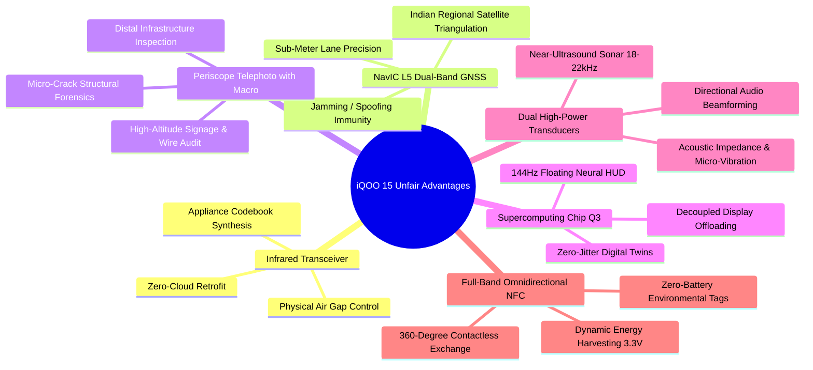

# 05_OPPORTUNITY_GAPS.md
## Strategic Opportunity Gaps & Unmet Innovation Vectors

**Document Version**: 1.0  
**Context**: iQOO Hackathon 2026 Grand Finale Strategic Ideation Framework  
**Scope**: Cross-Referencing Hardware Capabilities (Phase 2), Market & Winner Patterns (Phase 3), and Track Demands (Phase 0)  
**Date**: September 25, 2026

---

### Executive Summary

By intersecting the physical capabilities of the **iQOO 15 (Snapdragon 8 Elite Gen 5 + Supercomputing Chip Q3 + Flagship Peripherals)** with the competitive landscape of past hackathon winners, this document establishes the precise architectural vectors where our team (`HoloTrio`) can achieve an **unfair competitive advantage**.

Winning at the Grand Finale requires identifying capabilities that:
1. Cannot be replicated on competitor devices or generic laptops.
2. Exploit genuine physics-based sensor fusion rather than prompt engineering.
3. Solve severe, high-economic-gravity real-world problems.
4. Integrate naturally with the **Red Light (phone-first)** and **Office Kit (cross-device)** evaluation pillars.

---

### Part 1: Exploiting Rare & Underutilized iQOO 15 Hardware Capabilities

While common hackathon submissions rely solely on the main camera or standard GPS, the iQOO 15 possesses specialized hardware primitives that 95% of competitors ignore:



1. **Integrated Top-Frame IR Blaster (`ConsumerIrManager`)**:
   * *Status in Industry*: Virtually extinct on Apple, Google Pixel, and Samsung flagships; preserved on iQOO.
   * *Underutilized Opportunity*: Transforming the smartphone into an autonomous physical actuator that bridges legacy, non-smart electrical and industrial equipment (ACs, laboratory meters, projectors, industrial displays) without requiring Wi-Fi/Zigbee smart plugs or external hardware dongles.
2. **NavIC L5 Dual-Frequency Native GNSS**:
   * *Status in Industry*: Highly optimized on India-market Snapdragon 8 Elite chipsets.
   * *Underutilized Opportunity*: Exploiting the L5 Indian regional satellite constellation alongside GPS L1+L5 carrier-phase tracking to achieve sub-meter lane-level positioning, dead-reckoning calibration, and civilian GNSS spoofing detection that standard GPS fails to provide in Indian urban canyons.
3. **Sony IMX882 3x Optical Periscope Telephoto with Macro (15 cm)**:
   * *Status in Industry*: Rare optical configuration allowing both distant optical zoom (up to 100x digital) and extreme telephoto macro focusing at 15 centimeters.
   * *Underutilized Opportunity*: Optical inspection of high-risk, inaccessible infrastructure (overhead high-voltage power lines, railway catenary wires, bridge tension joints, distant roof cracks) while maintaining safe standoff distances.
4. **vivo Supercomputing Chip Q3 (Display Co-Processor)**:
   * *Status in Industry*: Proprietary secondary silicon dedicated to display pipeline frame interpolation and visual acceleration.
   * *Underutilized Opportunity*: Offloading real-time 3D spatial rendering, point cloud visualization, and developer HUD telemetry to the Q3 chip at 144 Hz, leaving 100% of the Snapdragon 8 Elite Hexagon NPU and Adreno 830 GPU free for heavy edge-AI inference.
5. **Acoustic Transducer Spectrum (Stereo Speakers up to 22.5 kHz + Triple MEMS Mics)**:
   * *Status in Industry*: Flagship acoustic passband extends beyond human hearing into near-ultrasound.
   * *Underutilized Opportunity*: Operating the phone as an **active FMCW acoustic radar/sonar** that emits 18–22 kHz chirps to measure tank liquid levels, detect wall surface voids, or track sub-millimeter chest wall respiratory motion without cameras.
6. **Omnidirectional High-Field NFC Controller**:
   * *Status in Industry*: High-field RF induction capability.
   * *Underutilized Opportunity*: Harvesting 3.3V DC power (up to 15–18 mW) directly from the phone’s NFC coil into batteryless dynamic sensor tags (e.g. ST25DV) embedded in concrete structures, soil, or medical patches.

---

### Part 2: High-Value Hardware Synergy Pairings (The "Unfair Advantage" Matrix)

True hackathon winners pair two disparate hardware subsystems to produce emergent capabilities that neither subsystem can achieve alone:

| Synergy Code | Subsystem A | Subsystem B | Emergent Capability | Hackathon Track Fit |
| :---: | :--- | :--- | :--- | :--- |
| **SYN-1** | **Camera2 (50MP Periscope)** | **NavIC L5 + E-Compass** | **Geodetic Spatial Triangulation**: Pinpoints distant physical assets (damaged power transformers, high-tension lines, railway switches) with metric GPS coordinates from 50 meters away by intersecting optical bearing angles with satellite geohashes. | Mobility / Developer Tools |
| **SYN-2** | **Hexagon NPU Vision Model** | **Consumer IR Blaster** | **Closed-Loop Visual-Infrared Actuation**: Computer vision reads an analog dial, room thermometer, or machine LED indicator; local SLM reasons on status; phone autonomously transmits 38 kHz NEC pulses to calibrate the machine in real time. | Smart Living / Open Innovation |
| **SYN-3** | **Stereo Loudspeakers (18–22kHz)** | **Triple MEMS Mics (48kHz)** | **Active FMCW Ultrasonic Sonar**: Non-optical, zero-light sonar imaging capable of measuring fluid tank fullness, wall density voids, or respiratory chest displacement with $<0.2\text{ mm}$ phase accuracy. | Smart Living / Mobility |
| **SYN-4** | **6-Axis IMU (200Hz direct)** | **Sony IMX921 Main Camera (OIS)** | **Quarter-Car Dynamic Pavement Profiler**: De-convolving vehicle vertical suspension acceleration via Kalman state-space equations while synchronous 60fps OIS vision segments pothole geometry down to ASTM D6433 PCI standards. | Mobility / Community App |
| **SYN-5** | **NFC RF Induction Coil** | **Local Hexagon SLM (Llama 3.2)** | **Batteryless Structural Health Probe**: Induces 3.3V power into passive bridge/soil sensor tags; reads micro-strain telemetry in $<15\text{ ms}$; on-device SLM generates structural engineering safety reports instantly. | Open Innovation / Developer Tools |
| **SYN-6** | **Qualcomm Sensing Hub BLE** | **7000 mAh Silicon Battery** | **72-Hour Zero-Power Disaster Mesh Relay**: Continuous background multi-hop mesh node routing emergency SOS packets without Android OS wakelock kills or battery depletion. | Community App / Open Innovation |
| **SYN-7** | **Supercomputing Chip Q3** | **Kernel `tracefs` & QNN Profiler**| **Zero-Overhead 144Hz Neural APM HUD**: Live on-device profiler rendering tensor layer latency, memory bus bandwidth, and NPU load directly on screen with $<0.5\%$ CPU overhead during mobile development. | Developer Tools / Productivity |
| **SYN-8** | **Dual X-Axis Linear Haptics** | **2000Hz Touch AMOLED Glass** | **Screen-as-Braille Sensory Substitution**: Generates localized micro-transient shear forces simulating raised tactile braille characters as visually impaired users glide their fingers over flat glass. | Community App / Open Innovation |

---

### Part 3: "Smartphone as X" — Archetype Opportunity Gaps

To stand out in the judging rounds, an idea should fit a powerful, intuitive archetype:

#### 1. Smartphone as a Precision Measurement Instrument
* *Traditional Paradigm*: Smartphone is an entertainment gadget or camera.
* *Opportunity Gap*: Modern phones contain sensors with lab-grade precision if properly calibrated.
* *High-Impact Concepts*:
  * Geodetic optical surveyor for civil engineering and rural land boundary verification.
  * Ultrasonic fluid/tank level and pipeline void acoustic sonograph.
  * Dynamic road roughness (IRI) and civil infrastructure vibration monitor.

#### 2. Smartphone as an Autonomous Physical Actuator / Bridge
* *Traditional Paradigm*: Phone is a passive display dashboard that sends cloud commands to smart hubs.
* *Opportunity Gap*: The phone directly controls dumb legacy physical infrastructure without intermediate gateways.
* *High-Impact Concepts*:
  * Vision-to-Infrared universal retrofitter for legacy commercial and domestic HVAC/equipment.
  * Direct NFC power-harvester powering batteryless field sensors.
  * USB-C OTG bridge converting the phone into the primary compute brain for low-cost robotic actuators.

#### 3. Smartphone as an Edge Server & Resilient Local Node
* *Traditional Paradigm*: Phone is a dumb client depending entirely on AWS / Azure.
* *Opportunity Gap*: Flagship processors possess compute power exceeding 2020 cloud servers (80+ TOPS NPU, 16GB RAM).
* *High-Impact Concepts*:
  * Zero-infrastructure localized disaster mesh communications node.
  * Private local multi-agent knowledge graph running completely in-memory.
  * Edge federated road hazard aggregator sharing spatial risk vectors via peer-to-peer Wi-Fi Aware.

#### 4. Smartphone as an Automotive / Mobility Co-Pilot
* *Traditional Paradigm*: Turn-by-turn navigation displaying colored map lines.
* *Opportunity Gap*: Consumer navigation ignores real-time kinetic vehicle safety, micro-pothole physics, and driver cognitive state.
* *High-Impact Concepts*:
  * Dual-camera kinetic safety system (front dashcam road defect detection + selfie camera driver gaze distraction) cross-referenced with NavIC lane positioning.
  * EV battery consumption predictor de-convolving real-world road grade, tire friction, and ambient temperature via on-device physics models.

#### 5. Smartphone as a Hardware-Aware Developer Runtime
* *Traditional Paradigm*: Developers must connect a USB cable to a desktop workstation running heavy Android Studio to inspect performance.
* *Opportunity Gap*: Developers cannot profile how their edge AI models perform on actual silicon under thermal load while away from their desks.
* *High-Impact Concepts*:
  * On-device neural model profiler and real-time quantization layer visualizer.
  * Autonomous mobile accessibility auditor executing live app UI traversals via local vision agents.
  * Mobile sensor calibration suite generating synthetic edge test vectors directly on device.

---

### Part 4: The 6-Track Strategic Opportunity Allocation

To ensure comprehensive coverage during Phase 5 (Idea Generation), the 50–70 ideas will be systematically distributed across the 6 official tracks according to high-conviction strategic gaps:

```
+-----------------------------------------------------------------------------------+
|                        STRATEGIC IDEA ALLOCATION MATRIX                           |
+-----------------------------------------------------------------------------------+
| 1. MOBILITY (10–12 Ideas)                                                         |
|    - Kinematic suspension deconvolution & lane-level NavIC pothole mapping        |
|    - EV range prediction via terrain physics & OBD-II Bluetooth bridging           |
|    - Underground / basement dead reckoning using 200Hz IMU + magnetic anomalies   |
|    - Dynamic multimodal fleet safety & driver distraction co-pilot                 |
+-----------------------------------------------------------------------------------+
| 2. COMMUNITY APP (10–12 Ideas)                                                    |
|    - Zero-infrastructure BLE/Wi-Fi Aware disaster communication mesh               |
|    - Spatial sensory substitution (Directional haptic + audio guidance for blind) |
|    - Localized civic infrastructure audit & automated legal compliance filing      |
|    - Peer-to-peer privacy-preserving edge knowledge graph                          |
+-----------------------------------------------------------------------------------+
| 3. SMART LIVING (10–12 Ideas)                                                     |
|    - Closed-loop vision-to-IR autonomous legacy appliance optimization             |
|    - Contactless acoustic FMCW sonar infant / sleep apnea vital monitor            |
|    - Zero-battery NFC energy-harvesting food / cold-chain freshness verifier       |
|    - Edge acoustic gas / water pipe leak triangulation                             |
+-----------------------------------------------------------------------------------+
| 4. PRODUCTIVITY (10–12 Ideas)                                                     |
|    - Local multimodal physical meeting recorder with spatial acoustic diarization  |
|    - Optical macro document forensics & anti-tamper watermark verification         |
|    - Autonomous on-device workflow agent with GBNF grammar-constrained execution   |
|    - Zero-cloud technical diagram to CAD / code synthesizer                        |
+-----------------------------------------------------------------------------------+
| 5. DEVELOPER TOOLS (10–12 Ideas)                                                  |
|    - Real-time on-device Hexagon NPU & GPU neural profiler HUD via Q3 chip         |
|    - Mobile sensor simulation & synthetic IMU/GNSS edge testing harness           |
|    - Automated Android accessibility traversal & WCAG compliance agent             |
|    - Offline LiteRT / QNN quantization tensor inspector & thermal stress bench     |
+-----------------------------------------------------------------------------------+
| 6. OPEN INNOVATION (10–12 Ideas)                                                  |
|    - Geodetic civil surveying via 3x Periscope optical bearing + NavIC L5          |
|    - Non-destructive structural deflection & bridge vibration monitor (MDPI 2025)  |
|    - Micro-spectrometry chemical dipstick verification via Color Spectrum sensor   |
|    - Low-cost teleoperated robotic manipulation brain via USB-C OTG                |
+-----------------------------------------------------------------------------------+
```
