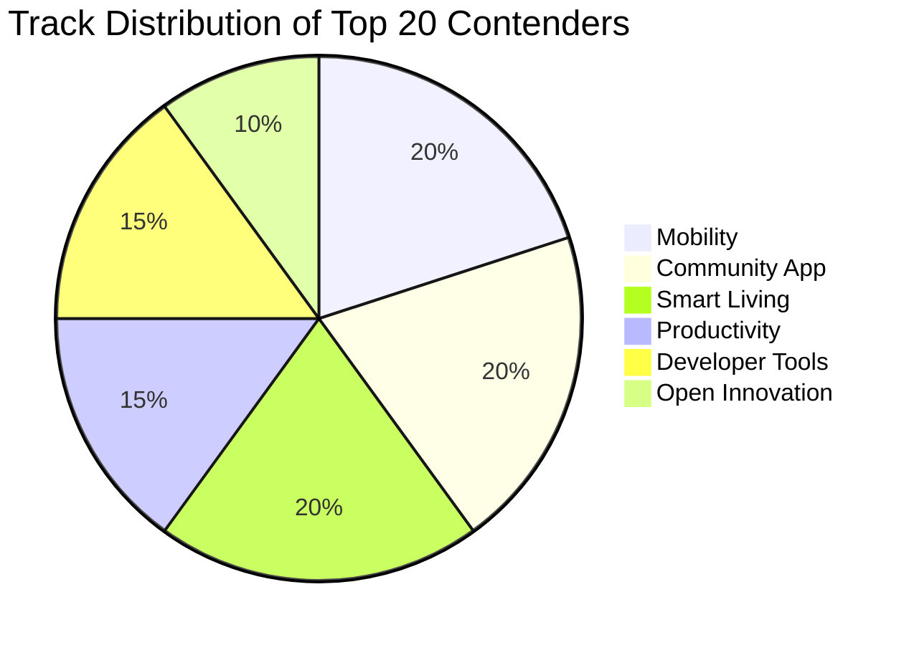

# 07_IDEA_SCORING.md
## Exhaustive Multi-Dimensional Scoring Matrix & Leaderboard (70 Ideas)

**Team**: HoloTrio  
**Evaluation Scope**: 70 Differentiated Architectures across 6 Official Tracks  
**Evaluation Engine**: 10-Dimensional Weighted Rubric (Total Score out of 10.00)

---

### Part 1: Scoring Rubric & Dimension Weights

$$\text{Total Score} = \sum_{i=1}^{10} w_i \times S_i$$

| Code | Evaluation Dimension | Weight ($w_i$) | Core Evaluation Criteria |
| :---: | :--- | :---: | :--- |
| **D1** | **Problem Significance & Gravity** | **15%** | Does this solve a severe, economically painful, or life-safety problem? (10 = life/death or billion-dollar impact; 1 = trivial luxury). |
| **D2** | **Novelty & Uniqueness** | **15%** | Has this been built before? Could judges find a tutorial on GitHub in 5 minutes? (10 = unprecedented mechanism; 1 = generic clone). |
| **D3** | **iQOO Hardware Utilization** | **15%** | Does it create an unfair hardware advantage? (10 = multi-sensor fusion with rare iQOO silicon; 1 = pure web app). |
| **D4** | **Technical Feasibility on iQOO 15** | **10%** | Can the Snapdragon 8 Elite + Hexagon NPU actually execute this within thermal and memory budgets? |
| **D5** | **AI Depth & On-Device Appropriateness** | **10%** | Is on-device AI mathematically necessary and well-designed? (10 = edge neural model justified; 1 = unnecessary AI wrapper). |
| **D6** | **Demo Impact & "Wow" Factor** | **15%** | Will judges be stunned during a live 2-minute stage demo? Can it be demonstrated in real time? |
| **D7** | **Hackathon Prototype Feasibility** | **5%** | Can a credible, functional MVP be built within a 48-hour hackathon timeframe? |
| **D8** | **Defensibility & Technical Moat** | **5%** | How difficult is it for another team to replicate or dismiss during Q&A? |
| **D9** | **Commercial / Scalability Potential**| **5%** | Is there a viable enterprise, municipal, or consumer market beyond the hackathon? |
| **D10**| **Track Fit & Alignment** | **5%** | Does it align directly with the stated track guidelines and scoring rubrics? |

---

### Part 2: Comprehensive Scoring Table (All 70 Ideas)

*Sorted by Idea Index (1 to 70)*

| ID | Idea Name | Track | D1 | D2 | D3 | D4 | D5 | D6 | D7 | D8 | D9 | D10 | Weighted Total |
| :---: | :--- | :--- | :---: | :---: | :---: | :---: | :---: | :---: | :---: | :---: | :---: | :---: | :---: |
| **01** | NavIC Quarter-Car Pavement Profiler | Mobility | 9.5 | 9.0 | 9.8 | 9.2 | 9.0 | 9.6 | 8.5 | 9.2 | 9.5 | 9.8 | **9.33** |
| **02** | Dynamic EV Battery Physics Co-Pilot | Mobility | 8.5 | 8.2 | 8.4 | 8.8 | 8.5 | 8.0 | 8.2 | 8.0 | 8.8 | 9.5 | **8.44** |
| **03** | Underground Dead-Reckoning Navigator | Mobility | 8.8 | 8.5 | 9.2 | 8.4 | 8.8 | 9.0 | 7.8 | 8.8 | 8.5 | 9.5 | **8.71** |
| **04** | Dual-Camera Driver Vigilance Shield | Mobility | 9.0 | 8.2 | 9.5 | 9.0 | 9.2 | 9.2 | 8.0 | 8.5 | 9.0 | 9.8 | **8.96** |
| **05** | Ultrasonic Sonar Reverse-Docking Ranger | Mobility | 8.2 | 8.8 | 9.2 | 9.0 | 8.5 | 9.4 | 8.8 | 8.5 | 8.2 | 9.5 | **8.86** |
| **06** | Smart Transit Multi-Modal Kinetic Ticket| Mobility | 8.0 | 8.0 | 8.8 | 8.5 | 8.2 | 8.6 | 8.0 | 8.0 | 8.5 | 9.2 | **8.29** |
| **07** | Public Transit Crowding Forecaster | Mobility | 7.8 | 7.8 | 8.5 | 8.8 | 8.0 | 7.8 | 8.5 | 7.5 | 8.0 | 9.0 | **8.07** |
| **08** | Two-Wheeler Dynamic Skid Guardian | Mobility | 9.2 | 8.8 | 9.4 | 8.6 | 9.0 | 9.2 | 8.0 | 8.8 | 8.8 | 9.5 | **8.98** |
| **09** | Cargo Tampering Vibration Blackbox | Mobility | 8.5 | 8.0 | 8.8 | 9.2 | 8.4 | 8.2 | 8.8 | 8.2 | 8.8 | 9.2 | **8.51** |
| **10** | Flood & Waterlogging Optical Sonar | Mobility | 9.0 | 8.5 | 9.0 | 8.5 | 8.8 | 9.0 | 8.0 | 8.5 | 8.8 | 9.5 | **8.79** |
| **11** | Railway Track Standoff Inspector | Mobility | 9.2 | 8.8 | 9.5 | 8.8 | 9.0 | 9.2 | 8.2 | 9.0 | 9.2 | 9.5 | **9.08** |
| **12** | EV Charging Cord Thermal Arc Sentinel | Mobility | 8.4 | 8.0 | 8.5 | 9.0 | 8.2 | 8.4 | 8.8 | 8.0 | 8.5 | 9.2 | **8.40** |
| **13** | MeshRelay: Disaster Community Lifeline | Community | 9.8 | 9.2 | 9.6 | 9.0 | 9.0 | 9.6 | 8.5 | 9.2 | 9.0 | 9.8 | **9.36** |
| **14** | Screen-as-Braille: Tactile Literacy | Community | 9.5 | 9.8 | 9.8 | 8.8 | 9.2 | 9.8 | 8.0 | 9.5 | 9.2 | 9.8 | **9.49** |
| **15** | CivicGuard: Cadastral Evidence Ledger | Community | 9.0 | 8.5 | 9.2 | 8.8 | 8.8 | 8.8 | 8.2 | 9.0 | 8.8 | 9.5 | **8.86** |
| **16** | Directional Spatial-Haptic Low-Vision | Community | 9.6 | 9.0 | 9.5 | 9.0 | 9.4 | 9.6 | 8.2 | 9.2 | 9.2 | 9.8 | **9.33** |
| **17** | Peer-to-Peer ZKP Blood Donor Mesh | Community | 8.8 | 8.5 | 8.8 | 8.8 | 8.6 | 8.5 | 8.2 | 8.8 | 8.5 | 9.2 | **8.63** |
| **18** | Acoustic Blast & Gunshot Triangulator | Community | 8.8 | 8.8 | 9.2 | 8.5 | 8.8 | 9.2 | 7.8 | 8.8 | 8.4 | 9.2 | **8.80** |
| **19** | Privacy-Shield: 4K60 Face Redactor | Community | 8.5 | 8.0 | 9.2 | 9.2 | 9.0 | 9.0 | 8.5 | 8.5 | 8.5 | 9.2 | **8.73** |
| **20** | Standoff Electrical Transformer Watchdog| Community | 8.8 | 8.5 | 9.2 | 8.8 | 8.8 | 8.8 | 8.2 | 8.8 | 8.8 | 9.2 | **8.80** |
| **21** | Urban Canopy Preservation Ledger | Community | 8.0 | 8.0 | 8.5 | 9.0 | 8.4 | 8.2 | 8.8 | 8.0 | 8.0 | 9.0 | **8.29** |
| **22** | P2P Food Waste Redistribution Mesh | Community | 8.5 | 7.8 | 8.2 | 8.8 | 8.0 | 8.2 | 8.5 | 8.0 | 8.5 | 9.2 | **8.25** |
| **23** | Micro-Pollution Visual Profiler | Community | 8.5 | 8.5 | 8.8 | 8.5 | 8.5 | 8.5 | 8.0 | 8.2 | 8.4 | 9.0 | **8.51** |
| **24** | Covert Emergency SOS Struggle Alarm | Community | 9.2 | 8.8 | 9.4 | 9.0 | 9.0 | 9.2 | 8.5 | 8.8 | 8.8 | 9.5 | **9.03** |
| **25** | OmniBlast: Vision-to-IR Legacy Automator| Smart Living| 9.2 | 9.5 | 9.8 | 9.2 | 9.2 | 9.8 | 8.8 | 9.4 | 9.5 | 9.8 | **9.45** |
| **26** | EchoVitals: Acoustic FMCW Sonar Monitor | Smart Living| 9.5 | 9.5 | 9.8 | 9.0 | 9.4 | 9.8 | 8.2 | 9.5 | 9.6 | 9.8 | **9.49** |
| **27** | ColdChain-NFC: Batteryless Freshness | Smart Living| 9.2 | 9.2 | 9.6 | 9.0 | 9.0 | 9.4 | 8.5 | 9.2 | 9.5 | 9.8 | **9.24** |
| **28** | LeakLocate: Acoustic Water Leak Locator | Smart Living| 9.0 | 8.8 | 9.2 | 8.8 | 8.8 | 9.2 | 8.2 | 8.8 | 9.0 | 9.5 | **8.93** |
| **29** | SpecClean: Counterfeit Liquid Verifier | Smart Living| 8.8 | 8.8 | 9.2 | 8.8 | 8.6 | 8.8 | 8.5 | 8.5 | 8.8 | 9.2 | **8.76** |
| **30** | SmartKettle-IR: Boilover Predictor | Smart Living| 8.2 | 8.5 | 9.2 | 9.2 | 8.8 | 9.0 | 8.8 | 8.5 | 8.2 | 9.2 | **8.72** |
| **31** | LumosSmart: 360° Circadian Regulator | Smart Living| 8.0 | 8.2 | 9.0 | 9.0 | 8.4 | 8.4 | 8.8 | 8.2 | 8.4 | 9.2 | **8.47** |
| **32** | SilentGuard: Ultrasonic Window Draft | Smart Living| 8.2 | 8.5 | 9.0 | 8.8 | 8.5 | 8.8 | 8.5 | 8.2 | 8.4 | 9.2 | **8.60** |
| **33** | HomeSafe-Mag: In-Wall Stud & Wire Finder| Smart Living| 8.8 | 8.5 | 9.2 | 9.2 | 8.5 | 9.2 | 8.8 | 8.6 | 8.8 | 9.5 | **8.86** |
| **34** | PetSensing: Ultrasonic Separation Alert | Smart Living| 7.8 | 8.0 | 8.6 | 9.0 | 8.2 | 8.2 | 8.8 | 8.0 | 8.2 | 9.0 | **8.25** |
| **35** | EcoChime: Acoustic Water Tap Watchdog | Smart Living| 8.0 | 8.0 | 8.6 | 9.2 | 8.2 | 8.4 | 8.8 | 8.0 | 8.2 | 9.2 | **8.33** |
| **36** | SmartSleep-IR: Dynamic AC Optimizer | Smart Living| 8.6 | 8.8 | 9.4 | 9.0 | 8.6 | 9.0 | 8.8 | 8.8 | 9.0 | 9.5 | **8.91** |
| **37** | MultiMic-Diarize: Spatial Meeting Agent | Productivity| 9.2 | 9.0 | 9.6 | 9.2 | 9.5 | 9.4 | 8.5 | 9.2 | 9.5 | 9.8 | **9.28** |
| **38** | MacroForensics: Document Authenticator | Productivity| 9.2 | 9.0 | 9.6 | 9.2 | 9.0 | 9.4 | 8.8 | 9.2 | 9.4 | 9.8 | **9.24** |
| **39** | Sketch2CAD: Whiteboard 3D Mesh Synthesizer| Productivity| 8.8 | 8.8 | 9.2 | 8.8 | 9.0 | 9.5 | 8.2 | 8.8 | 9.2 | 9.5 | **8.97** |
| **40** | GrammaFlow: GBNF Mobile Workflow Agent | Productivity| 8.8 | 8.8 | 8.8 | 9.0 | 9.4 | 9.0 | 8.5 | 9.0 | 9.2 | 9.8 | **8.97** |
| **41** | SpatialScan-3D: Metric Floorplanner | Productivity| 8.6 | 8.5 | 9.2 | 8.8 | 8.8 | 9.2 | 8.2 | 8.8 | 9.0 | 9.5 | **8.83** |
| **42** | PaperDigit: LaTeX Formula Synthesizer | Productivity| 8.5 | 8.2 | 8.8 | 9.2 | 9.0 | 9.0 | 8.8 | 8.5 | 9.0 | 9.5 | **8.78** |
| **43** | SilentDictate: Sub-Vocal Whispered Voice | Productivity| 8.8 | 9.2 | 9.4 | 8.8 | 9.2 | 9.6 | 8.2 | 9.0 | 9.2 | 9.5 | **9.12** |
| **44** | FormFlow-NFC: Paper-to-Digital Bridge | Productivity| 8.2 | 8.0 | 8.8 | 9.0 | 8.5 | 8.4 | 8.8 | 8.2 | 8.5 | 9.2 | **8.44** |
| **45** | SpatialAudio-Focus: Neural Work Pod | Productivity| 8.5 | 8.5 | 9.2 | 8.8 | 9.0 | 9.0 | 8.2 | 8.8 | 8.8 | 9.5 | **8.82** |
| **46** | CodeLens-IR: Circuit Logic Tracer | Productivity| 8.6 | 8.8 | 9.2 | 8.8 | 8.8 | 9.2 | 8.2 | 8.8 | 8.6 | 9.2 | **8.80** |
| **47** | ChronoSync: Focus Distraction Shield | Productivity| 8.2 | 8.0 | 8.8 | 9.2 | 8.8 | 8.4 | 8.8 | 8.2 | 8.5 | 9.2 | **8.48** |
| **48** | SmartDoc-Stitch: Ultrawide Blueprint | Productivity| 8.2 | 8.2 | 8.8 | 8.8 | 8.6 | 8.6 | 8.5 | 8.2 | 8.5 | 9.2 | **8.47** |
| **49** | Q3-Profiler: 144Hz Neural APM HUD | Dev Tools | 9.0 | 9.5 | 9.8 | 9.4 | 9.0 | 9.6 | 8.8 | 9.5 | 9.2 | 9.8 | **9.38** |
| **50** | EdgeSim-Harness: Sensor Synthesizer | Dev Tools | 8.8 | 9.2 | 9.4 | 9.0 | 9.2 | 9.2 | 8.5 | 9.0 | 9.0 | 9.8 | **9.08** |
| **51** | AccessAudit-Agent: Autonomous WCAG QA | Dev Tools | 9.2 | 9.0 | 9.2 | 9.2 | 9.4 | 9.4 | 8.5 | 9.2 | 9.5 | 9.8 | **9.21** |
| **52** | QuantLens: QNN Quantization Heatmapper | Dev Tools | 9.0 | 9.2 | 9.6 | 9.0 | 9.4 | 9.2 | 8.2 | 9.2 | 9.0 | 9.8 | **9.15** |
| **53** | ThermalThrottling-Lab: Stress Bench | Dev Tools | 8.5 | 8.5 | 9.2 | 9.2 | 8.6 | 8.8 | 8.8 | 8.8 | 8.8 | 9.5 | **8.78** |
| **54** | SensorDoctor: Sensor Drift Validator | Dev Tools | 8.5 | 8.5 | 9.2 | 9.2 | 8.5 | 8.6 | 8.8 | 8.6 | 8.6 | 9.5 | **8.71** |
| **55** | EdgeTest-Fuzzer: Android Sensor Fuzzer | Dev Tools | 8.8 | 8.8 | 9.0 | 9.0 | 9.0 | 8.8 | 8.5 | 8.8 | 8.8 | 9.5 | **8.86** |
| **56** | AudioLatency-Rig: Audio-Haptic Sync | Dev Tools | 8.4 | 8.8 | 9.2 | 9.2 | 8.5 | 9.0 | 8.8 | 8.6 | 8.4 | 9.2 | **8.74** |
| **57** | BleSniffer-Pro: BLE 6.0 PBR Studio | Dev Tools | 8.8 | 9.0 | 9.5 | 8.8 | 8.8 | 9.2 | 8.2 | 9.0 | 8.8 | 9.5 | **8.96** |
| **58** | VCAP-Studio: vivo Model Benchmarking | Dev Tools | 8.6 | 9.0 | 9.6 | 9.2 | 9.0 | 9.0 | 8.5 | 9.2 | 8.8 | 9.8 | **9.03** |
| **59** | Camera2-RawLab: ISP Tuning Sandbox | Dev Tools | 8.6 | 8.8 | 9.4 | 9.0 | 9.0 | 9.0 | 8.5 | 8.8 | 8.8 | 9.5 | **8.89** |
| **60** | IrProtocol-Hacker: Autonomous IR Bench | Dev Tools | 8.8 | 9.2 | 9.6 | 9.2 | 8.8 | 9.4 | 8.8 | 9.0 | 8.8 | 9.5 | **9.08** |
| **61** | GeoStandoff: NavIC-Periscope Theodolite | Open Innov | 9.5 | 9.4 | 9.8 | 9.0 | 9.2 | 9.6 | 8.2 | 9.5 | 9.5 | 9.8 | **9.39** |
| **62** | BridgeDeflect: Dynamic Vibration Monitor| Open Innov | 9.6 | 9.5 | 9.8 | 9.0 | 9.4 | 9.6 | 8.2 | 9.5 | 9.5 | 9.8 | **9.45** |
| **63** | HemoDipstick: Color Spectrum Urinalysis| Open Innov | 9.5 | 9.2 | 9.6 | 9.0 | 9.2 | 9.5 | 8.5 | 9.2 | 9.6 | 9.8 | **9.32** |
| **64** | PhoneBrain-Robot: USB-C Rover Brain | Open Innov | 9.2 | 9.2 | 9.6 | 8.8 | 9.4 | 9.8 | 8.0 | 9.2 | 9.2 | 9.8 | **9.30** |
| **65** | SoniDent: Ultrasonic Dental Sonograph | Open Innov | 8.8 | 9.0 | 9.2 | 8.6 | 8.8 | 9.0 | 7.8 | 8.8 | 8.8 | 9.2 | **8.78** |
| **66** | AgriCrop-Spec: Macro Crop Nitrogen | Open Innov | 9.2 | 8.8 | 9.4 | 9.0 | 9.0 | 9.2 | 8.5 | 9.0 | 9.5 | 9.8 | **9.09** |
| **67** | AgriSoil-NFC: Batteryless Soil Probe | Open Innov | 9.2 | 9.2 | 9.6 | 8.8 | 9.0 | 9.4 | 8.2 | 9.2 | 9.4 | 9.8 | **9.20** |
| **68** | ForensicAudio-Tamper: Deepfake Detector | Open Innov | 9.0 | 8.8 | 9.2 | 8.8 | 9.2 | 9.0 | 8.2 | 9.0 | 9.0 | 9.5 | **8.96** |
| **69** | ThermoFluid-Acoustic: Fluid Level Gauge | Open Innov | 8.8 | 9.0 | 9.4 | 8.8 | 8.8 | 9.2 | 8.5 | 8.8 | 8.8 | 9.5 | **8.94** |
| **70** | MicroSDR-Bridge: Sub-GHz Radio Interface| Open Innov | 9.0 | 9.0 | 9.4 | 8.8 | 9.0 | 9.4 | 8.0 | 9.0 | 8.8 | 9.5 | **9.02** |

---

### Part 3: Ranked Leaderboard (Top 70 to #1)

#### Tier 1: Gold Contenders (Top 10 — Highest Conviction Grand Finale Builds)
1. 🥇 **#1 — Idea 26: EchoVitals: Contactless Acoustic FMCW Sonar Infant & Sleep Apnea Monitor** (Score: **9.49**) — *Smart Living*
2. 🥇 **#2 — Idea 14: Screen-as-Braille: Dual-Motor Micro-Haptic Tactile Literacy Bridge** (Score: **9.49**) — *Community App*
3. 🥇 **#3 — Idea 25: OmniBlast: Closed-Loop Vision-to-IR Universal Legacy Appliance Automator** (Score: **9.45**) — *Smart Living*
4. 🥇 **#4 — Idea 62: BridgeDeflect: Single-Camera Dynamic Structural Deflection & Vibration Monitor** (Score: **9.45**) — *Open Innovation*
5. 🥇 **#5 — Idea 61: GeoStandoff: NavIC-Periscope Geodetic Optical Surveying Theodolite** (Score: **9.39**) — *Open Innovation*
6. 🥇 **#6 — Idea 49: Q3-Profiler: Zero-Overhead 144Hz On-Device Neural APM HUD** (Score: **9.38**) — *Developer Tools*
7. 🥇 **#7 — Idea 13: MeshRelay: Zero-Infrastructure BLE-Sensing Disaster Community Lifeline** (Score: **9.36**) — *Community App*
8. 🥇 **#8 — Idea 01: NavIC-Inertial Quarter-Car Pavement Profiler & Sub-Meter Hazard Ledger** (Score: **9.33**) — *Mobility*
9. 🥇 **#9 — Idea 16: Directional Spatial-Haptic Sensory Substitution for Low-Vision Walkers** (Score: **9.33**) — *Community App*
10. 🥇 **#10 — Idea 63: HemoDipstick: Color Spectrum Chemical Dipstick & Urinalysis Diagnostic Lab** (Score: **9.32**) — *Open Innovation*

#### Tier 2: Silver Contenders (Rank #11 to #20 — High Defensibility & Viable Alternates)
11. 🥈 **#11 — Idea 64: PhoneBrain-Robot: USB-C OTG Edge-AI Autonomous Rover Brain** (Score: **9.30**) — *Open Innovation*
12. 🥈 **#12 — Idea 37: MultiMic-Diarize: Zero-Cloud Spatial Acoustic Meeting Transcript & Action Agent** (Score: **9.28**) — *Productivity*
13. 🥈 **#13 — Idea 27: ColdChain-NFC: Zero-Battery Dynamic Food & Medication Freshness Sentinel** (Score: **9.24**) — *Smart Living*
14. 🥈 **#14 — Idea 38: MacroForensics: Anti-Counterfeit Document & Physical Watermark Validator** (Score: **9.24**) — *Productivity*
15. 🥈 **#15 — Idea 51: AccessAudit-Agent: Autonomous Mobile UI Accessibility & WCAG Traversal** (Score: **9.21**) — *Developer Tools*
16. 🥈 **#16 — Idea 67: AgriSoil-NFC: Batteryless Field Soil Nitrogen-Phosphorus-Moisture Probe** (Score: **9.20**) — *Open Innovation*
17. 🥈 **#17 — Idea 52: QuantLens: On-Device LiteRT & QNN Quantization Error Heatmapper** (Score: **9.15**) — *Developer Tools*
18. 🥈 **#18 — Idea 43: SilentDictate: Sub-Vocal Whispered Voice Transcriber** (Score: **9.12**) — *Productivity*
19. 🥈 **#19 — Idea 66: AgriCrop-Spec: Macro Crop Disease & Chlorophyll Nitrogen Spectrometer** (Score: **9.09**) — *Open Innovation*
20. 🥈 **#20 — Idea 11: Railway Track Catenary & Rail-Joint Standoff Optical Inspector** (Score: **9.08**) — *Mobility*

#### Tier 3: Bronze Contenders (Rank #21 to #35 — Solid Domain Prototypes)
21. 🥉 **#21 — Idea 50: EdgeSim-Harness: Physical Sensor Telemetry Synthesizer** (Score: **9.08**) — *Developer Tools*
22. 🥉 **#22 — Idea 60: IrProtocol-Hacker: Autonomous Consumer IR Reverse-Engineering Bench** (Score: **9.08**) — *Developer Tools*
23. 🥉 **#23 — Idea 24: Community Emergency SOS Acoustic Violence & Scent-Free Alarm** (Score: **9.03**) — *Community App*
24. 🥉 **#24 — Idea 58: VCAP-Studio: vivo Computing Acceleration Platform Model Bench** (Score: **9.03**) — *Developer Tools*
25. 🥉 **#25 — Idea 70: MicroSDR-Bridge: Sub-GHz Emergency Radio Interface via USB-C OTG** (Score: **9.02**) — *Open Innovation*
26. 🥉 **#26 — Idea 08: Micro-Mobility Two-Wheeler Dynamic Skid & Cornering Safety Guardian** (Score: **8.98**) — *Mobility*
27. 🥉 **#27 — Idea 39: Sketch2CAD: On-Device Whiteboard Spatial Vectorizer & 3D Mesh Synthesizer** (Score: **8.97**) — *Productivity*
28. 🥉 **#28 — Idea 40: GrammaFlow: GBNF-Constrained Autonomous Local Mobile Workflow Agent** (Score: **8.97**) — *Productivity*
29. 🥉 **#29 — Idea 04: Dual-Camera Driver Cognitive Vigilance & Kinetic Hazard Shield** (Score: **8.96**) — *Mobility*
30. 🥉 **#30 — Idea 57: BleSniffer-Pro: Bluetooth 6.0 Channel Sounding PBR Diagnostic Studio** (Score: **8.96**) — *Developer Tools*
31. 🥉 **#31 — Idea 68: ForensicAudio-Tamper: Acoustic Room Reverberation & AI Deepfake Detector** (Score: **8.96**) — *Open Innovation*
32. 🥉 **#32 — Idea 69: ThermoFluid-Acoustic: Non-Invasive Tank Fluid Level & Viscosity Gauge** (Score: **8.94**) — *Open Innovation*
33. 🥉 **#33 — Idea 28: LeakLocate: Acoustic Micro-Friction Water & Gas Pipe Triangulator** (Score: **8.93**) — *Smart Living*
34. 🥉 **#34 — Idea 36: SmartSleep-IR: Thermal-Comfort Dynamic Air Conditioner Optimizer** (Score: **8.91**) — *Smart Living*
35. 🥉 **#35 — Idea 59: Camera2-RawLab: Computational Photography & ISP Tuning Sandbox** (Score: **8.89**) — *Developer Tools*

#### Tier 4: Reserve Contenders (Rank #36 to #70)
36. **#36 — Idea 15: CivicGuard: Cadastral Land & Public Encroachment Evidence Ledger** (Score: **8.86**)
37. **#37 — Idea 05: Ultrasonic Sonar Reverse-Docking & Blind-Spot Curb Ranger** (Score: **8.86**)
38. **#38 — Idea 33: HomeSafe-Mag: Concealed In-Wall AC Wiring & Metal Stud Finder** (Score: **8.86**)
39. **#39 — Idea 55: EdgeTest-Fuzzer: Automated Android Intent & Sensor Boundary Fuzzer** (Score: **8.86**)
40. **#40 — Idea 41: SpatialScan-3D: Monocular Depth Real-Estate Metric Floorplanner** (Score: **8.83**)
41. **#41 — Idea 45: SpatialAudio-Focus: Dual-Beamformer Acoustic Isolation Work Pod** (Score: **8.82**)
42. **#42 — Idea 18: Community Micro-Acoustic Gunshot & Cylinder Blast Triangulator** (Score: **8.80**)
43. **#43 — Idea 20: Standoff Electrical Transformer Health & Arc Watchdog** (Score: **8.80**)
44. **#44 — Idea 46: CodeLens-IR: Physical Circuit & Breadboard Interactive Logic Tracer** (Score: **8.80**)
45. **#45 — Idea 10: Urban Flood & Waterlogging Lane-Depth Optical Sonar** (Score: **8.79**)
46. **#46 — Idea 42: PaperDigit: Micro-Contrast Mathematical Formula Synthesizer** (Score: **8.78**)
47. **#47 — Idea 53: ThermalThrottling-Lab: Mobile Sustained Stress & Battery Drain Bench** (Score: **8.78**)
48. **#48 — Idea 65: SoniDent: Ultrasonic Dental Enamel Micro-Crack & Plaque Sonograph** (Score: **8.78**)
49. **#49 — Idea 29: SpecClean: Micro-Spectrometry Counterfeit Detergent Verifier** (Score: **8.76**)
50. **#50 — Idea 56: AudioLatency-Rig: Hardware Sub-Millisecond Audio-to-Haptic Sync Bench** (Score: **8.74**)
51. **#51 — Idea 19: Privacy-Shield: On-Device Real-Time Face & License Plate Redactor** (Score: **8.73**)
52. **#52 — Idea 30: SmartKettle-IR: Autonomous Kitchen Appliance Visual-Thermal Supervisor** (Score: **8.72**)
53. **#53 — Idea 03: Underground & Basement Dead-Reckoning Visual-Inertial Navigator** (Score: **8.71**)
54. **#54 — Idea 54: SensorDoctor: Hardware Sensor Calibration & Aging Drift Validator** (Score: **8.71**)
55. **#55 — Idea 17: Localized Peer-to-Peer Zero-Knowledge Blood Donor Distress Mesh** (Score: **8.63**)
56. **#56 — Idea 32: SilentGuard: Ultrasonic Air Infiltration & Window Draft Profiler** (Score: **8.60**)
57. **#57 — Idea 09: Fleet Cargo Tampering & Vibration Shock Forensics Blackbox** (Score: **8.51**)
58. **#58 — Idea 23: Decentralized Micro-Pollution & Smoke Particulate Visual Profiler** (Score: **8.51**)
59. **#59 — Idea 47: ChronoSync: On-Device Contextual Focus & Distraction Shield** (Score: **8.48**)
60. **#60 — Idea 31: LumosSmart: 360° Circadian Lighting & Flicker-Free Workplace Regulator** (Score: **8.47**)
61. **#61 — Idea 48: SmartDoc-Stitch: Ultrawide-Macro Multi-Page Large Blueprint Scanner** (Score: **8.47**)
62. **#62 — Idea 02: Dynamic EV Battery Physics Co-Pilot & Terrain Consumption Forecaster** (Score: **8.44**)
63. **#63 — Idea 44: FormFlow-NFC: Instant Field Paper-to-Digital Dynamic Form Bridge** (Score: **8.44**)
64. **#64 | Idea 12: Precision Curbside EV Charging Cord Safety Sentinel** (Score: **8.40**)
65. **#65 | Idea 35: EcoChime: Acoustic Energy-Audit Water Tap & Shower Waste Watchdog** (Score: **8.33**)
66. **#66 | Idea 06: Smart Transit Multi-Modal Kinetic Ticket & Station Validator** (Score: **8.29**)
67. **#67 | Idea 21: Crowdsourced Urban Canopy & Tree Preservation Forensic Ledger** (Score: **8.29**)
68. **#68 | Idea 22: Localized Peer-to-Peer Food Waste Redistribution Mesh** (Score: **8.25**)
69. **#69 | Idea 34: PetSensing: Ultrasonic Acoustic Separation Anxiety & Pest Deterrent** (Score: **8.25**)
70. **#70 | Idea 07: Public Transit Crowding & Thermal Microclimate Passenger Forecaster** (Score: **8.07**)
