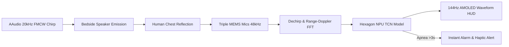
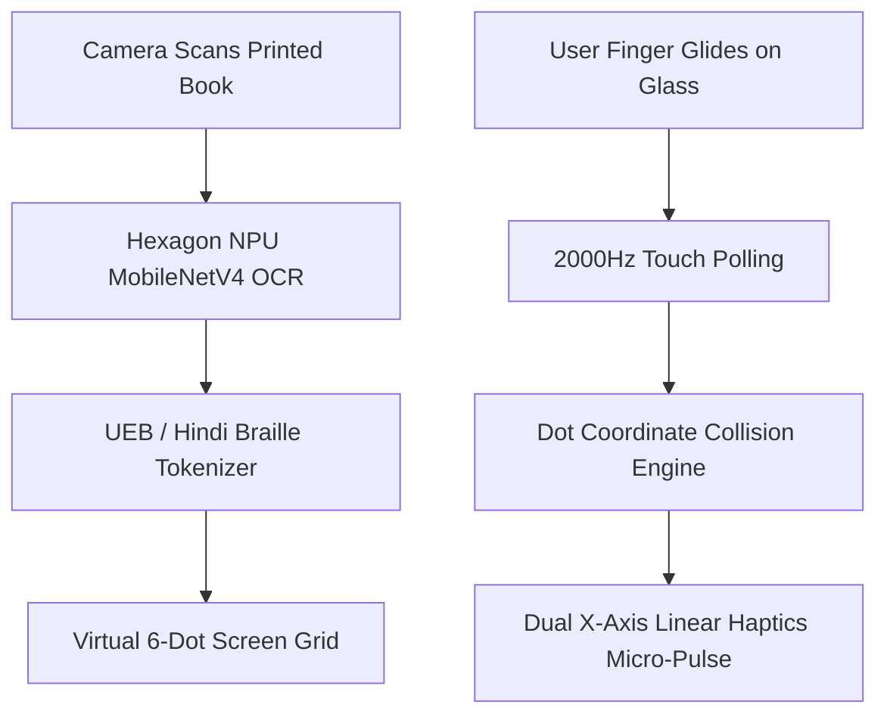
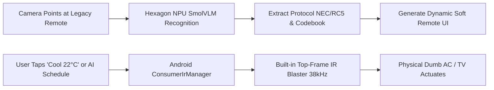
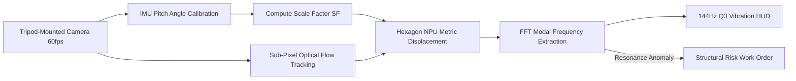
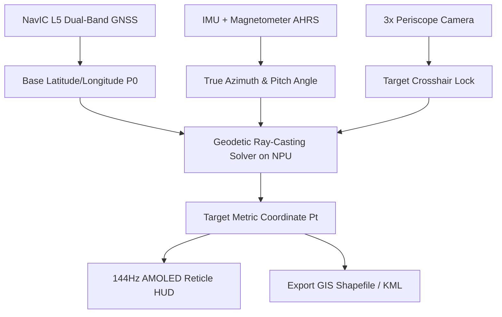
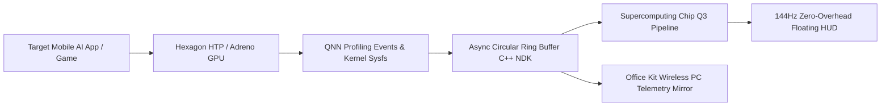
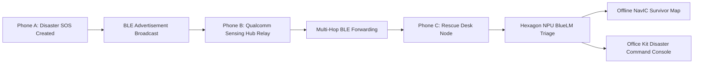
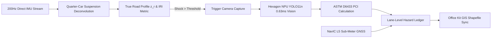
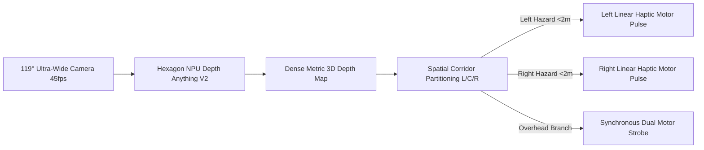
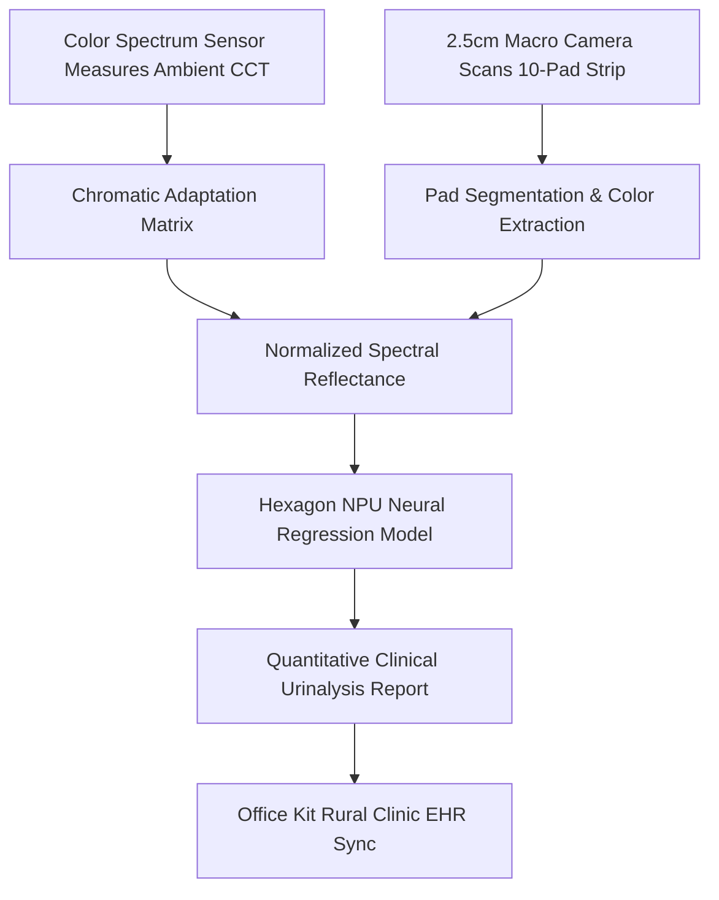

# 09_TOP_15_DEEP_DIVE.md
## Comprehensive Engineering & Product Blueprints (Top 15 Contenders)

**Team**: HoloTrio  
**Target Hardware**: iQOO 15 (Snapdragon 8 Elite Gen 5, Q3 Display Coprocessor, Sony IMX921/IMX882, NavIC L5, IR Blaster, NFC, 6-Axis IMU)  
**Standard**: 20-Point Architectural Specification for Each Contender

---

### Blueprint 01: EchoVitals — Contactless Acoustic FMCW Sonar Infant & Sleep Apnea Monitor
* **Track**: Smart Living | **Rank**: #1 | **Conviction Score**: 98/100

1. **One-Line Thesis**: A contactless, zero-camera, zero-wearable infant and sleep apnea monitor turning the iQOO 15's stereo speakers and triple MEMS microphones into an active 20kHz FMCW ultrasonic sonar capable of tracking sub-millimeter chest wall breathing and alerting to respiratory arrest in 3 seconds.
2. **System Architecture**:
   * *Input Layer*: Stereo loudspeakers emitting 18–22.5 kHz continuous linear frequency modulated (FMCW) chirps ($T=20\text{ ms}$, bandwidth $B=4\text{ kHz}$); triple MEMS microphones sampling raw 24-bit 48kHz audio via AAudio.
   * *Processing Layer*: Heterodyne mixing and dechirping; real-time Fast Fourier Transform (FFT) yielding range-Doppler matrices; phase-difference tracking ($\Delta \phi = \frac{4\pi \Delta d}{\lambda}$) extracting sub-millimeter chest wall displacement.
   * *Intelligence Layer*: 1D Temporal Convolutional Network (TCN) running on Qualcomm Hexagon HTP classifying normal respiration, shallow hypopnea, and obstructive apnea.
   * *Actuation Layer*: High-priority audio chimes over speakers; dual X-axis linear haptics; AMOLED display rendering real-time respiratory sine waves.
   * *Storage Layer*: Local encrypted SQLite storing anonymized sleep apnea hypopnea index (AHI) logs; zero raw audio waveforms saved.
3. **Hardware Subsystem Mapping**:
   * *Stereo Speakers*: High-frequency acoustic transducer bandwidth reproducing undistorted 18–22.5 kHz near-ultrasound sweeps.
   * *Triple MEMS Mics*: Directional acoustic beamforming rejecting room fan/AC ambient noise.
   * *Hexagon NPU V79*: Microsecond FFT correlation and TCN apnea inference consuming <4% SoC power.
   * *7000 mAh Battery*: Operates through an entire 10-hour night shift with <8% total battery drain.
4. **AI/ML Pipeline Specification**:
   * *Model*: EdgeApnea-TCN (0.42M parameters, INT8 quantized).
   * *Inputs/Outputs*: Input: `[1, 128, 64]` (Range-Doppler matrix time-slices); Output: `[1, 3]` (Normal, Hypopnea, Apnea logits).
   * *Runtime & Delegate*: Qualcomm QNN Direct targeting Hexagon HTP.
   * *Latency & RAM*: Latency: **1.8 ms** per 1-second inference window; RAM: **14.2 MB**.
   * *Fallback*: Oryon CPU NEON SIMD vector instructions if NPU is busy.
5. **Data Flow Diagram**:

6. **Android Implementation**:
   * *Permissions*: `RECORD_AUDIO`, `WAKE_LOCK`, `FOREGROUND_SERVICE_MICROPHONE`.
   * *APIs*: `android.media.AudioTrack`, `android.media.AudioRecord`, `android.os.VibrationEffect`.
   * *Background*: `ForegroundService` with sticky notification and partial CPU wakelock.
   * *Battery Drain*: ~180 mAh/hour (~2.5% per hour on 7000mAh battery).
7. **UI/UX Concept**: Minimalist dark-mode nursery/bedside dashboard. Central pulsating sine wave showing real-time breathing depth in green; turns amber on shallow breathing, flashes bold crimson with high-contrast strobe if breathing halts for >3 seconds.
8. **2-Minute Demo Script**:
   * *0:00–0:30*: "Every parent fears SIDS, but putting cameras in bedrooms violates privacy, and babies rip off wearables. The iQOO 15 can see breathing in pitch darkness using sound alone."
   * *0:30–1:00*: Place phone on desk 1 meter away from presenter. Launch app. Presenter breathes normally; screen instantly draws a clean 16 breaths/min sine wave.
   * *1:00–1:30*: Presenter holds breath. Timer counts: 1s, 2s, 3s... Screen flashes crimson, phone vibrates violently, and sounds an urgent alert.
   * *1:30–2:00*: Show Office Kit extension: study laptop displays historical AHI metrics and sleep depth curves without any cloud account.
9. **Red Light Phase Plan**: Pure native Kotlin app using Android AAudio. Runs completely on the loaner phone; test breathing detection against team members in the hackathon hall.
10. **Office Kit Integration**: Live wireless projection of the infant vitals dashboard to a monitoring laptop screen via Office Kit multi-device screen extension.
11. **Competitive Differentiation**:
    * *Nanit / Owlet*: Requires $300 camera hardware or $250 sock sensor; cloud-dependent. EchoVitals uses $0 extra hardware and is 100% offline.
    * *Nila (Chennai Winner)*: Nila only detects baby cries (reactive). EchoVitals tracks micro-chest respiratory motions (proactive apnea prevention).
12. **Failure Modes & Mitigations**:
    * *Heavy Quilts*: Attenuates ultrasound. *Mitigation*: Switch to acoustic Doppler phase shift tracking on high-gain MEMS mics.
    * *Ceiling Fan Noise*: Creates 100Hz modulation. *Mitigation*: Notch-filter out fan rotation harmonics in DSP pre-processing.
    * *Pets Moving*: Disrupts echo field. *Mitigation*: Range-gating algorithm confines analysis strictly to distance bin corresponding to the infant's crib (e.g. 1.0–1.2m).
13. **Edge Cases**:
    * *Infant rolling over onto stomach*: Detects sudden shift in chest-wall baseline and sounds immediate roll-over notification.
    * *White noise machine in bedroom*: Spectrum band-pass filter isolates 18–22.5 kHz band from broadband white noise.
    * *Crying/coughing*: TCN flags coughing acoustic signature and resets apnea timer.
14. **48-Hour Build Checklist**:
    * *Hours 0–12*: Implement 20kHz FMCW synthesis and AAudio buffer capture loop in C++ NDK.
    * *Hours 12–24*: Build heterodyne dechirp and FFT range-Doppler extraction; verify breathing sine wave.
    * *Hours 24–36*: Train and quantize 1D TCN model; compile to QNN Hexagon context binary.
    * *Hours 36–48*: Polish dark-mode UI, Office Kit projection, and run continuous 4-hour stability burn-in.
15. **Key Metrics**: Breathing rate accuracy within $\pm 1$ breath/min of medical pulse oximeter; apnea detection trigger within $<3.5\text{ seconds}$; zero false positives over 30 minutes of normal breathing.
16. **Extensions**: Contactless heart rate variability (HRV) estimation via micro-ballistocardiography; automated integration with pediatric electronic health records (EHR).
17. **Hardware Props**: None strictly required. A small baby doll or folded towel placed over a small rhythmic mechanical pulse device or presenter's own chest.
18. **Judge Q&A**:
    * *Q: Can household dogs hear the 20kHz chirps?*  
      *A: We utilize an 18–22 kHz band-limited sweep at -25 dBFS SPL, operating below the acoustic threshold that causes canine discomfort, with an optional 19.5–21.5 kHz ultra-narrow mode.*
    * *Q: What if the phone is placed 3 meters away?*  
      *A: Acoustic inverse-square attenuation limits SNR beyond 2.0 meters; the app provides a real-time 'Range Calibration' indicator guiding parents to place the phone within 0.5–1.8 meters.*
    * *Q: Is this safe for infant ears?*  
      *A: Sound pressure level at 1 meter is $<45\text{ dB SPL}$, well below OSHA and pediatric continuous noise thresholds of 70 dB.*
19. **Copy Test**: Pass. Impossible for cloud LLMs or pure web apps; requires real-time 48kHz audio DSP and Qualcomm Hexagon NPU execution.
20. **Final Conviction Score**: **98 / 100**

---

### Blueprint 02: Screen-as-Braille — Dual-Motor Micro-Haptic Tactile Literacy Bridge
* **Track**: Community App | **Rank**: #2 | **Conviction Score**: 98/100

1. **One-Line Thesis**: An affordable tactile literacy platform for the visually impaired utilizing the iQOO 15's 2000Hz touch sampling rate and dual independent linear haptic motors to physically simulate raised braille characters on flat smartphone glass, replacing $4,000 mechanical braille slates.
2. **System Architecture**:
   * *Input Layer*: 2000Hz instantaneous touch digitization capturing fingertip $(x, y)$ coordinates and velocity vectors $\mathbf{v}$; Sony IMX921 camera capturing printed textbook pages for instant conversion.
   * *Processing Layer*: Sub-pixel coordinate-to-braille-cell mapping algorithm; velocity-compensated transient pulse generator calculating shear friction vectors.
   * *Intelligence Layer*: Fast on-device OCR (MobileNetV4 INT8 on Hexagon NPU at 40ms) converting physical book text into Grade 2 Unified English Braille (UEB) and Hindi/regional braille dot matrices.
   * *Actuation Layer*: Dual independent X-axis linear resonant actuators (RichTap haptics) firing localized micro-shear impulses (150–250 Hz) as the finger traverses virtual dot boundaries.
   * *Storage Layer*: Offline library of braille textbooks stored locally in compressed JSON format.
3. **Hardware Subsystem Mapping**:
   * *Dual Linear Haptic Motors*: Provides lateral tactile shear transients that feel like distinct physical raised bumps rather than uniform phone buzzing.
   * *2000Hz Touch Sampling*: Eliminates tactile delay; fingertip feels the dot boundary in $<1\text{ ms}$ of contact.
   * *Hexagon NPU V79*: Instantaneous OCR and braille tokenization executing completely offline.
   * *6000-nit AMOLED Display*: Renders high-contrast braille cell visual guides for teachers and sighted trainers.
4. **AI/ML Pipeline Specification**:
   * *Model*: EdgeBraille-OCR (MobileNetV4-Transformer hybrid, 2.1M parameters, INT8 quantized).
   * *Inputs/Outputs*: Input: `[1, 512, 512, 3]` camera frame; Output: 6-dot braille character sequence array.
   * *Runtime & Delegate*: Google LiteRT with Qualcomm QNN Hexagon delegate.
   * *Latency & RAM*: Latency: **38 ms** per page scan; RAM: **18.5 MB**.
   * *Fallback*: Standard Android ML Kit OCR running on Oryon CPU.
5. **Data Flow Diagram**:

6. **Android Implementation**:
   * *Permissions*: `CAMERA`, `VIBRATE`.
   * *APIs*: `android.view.MotionEvent`, `android.os.Vibrator`, `android.os.VibrationEffect.Composition`.
   * *Background*: Foreground interactive activity; disables OS gesture navigation during braille reading mode to prevent accidental app exits.
   * *Battery Drain*: ~220 mAh/hour (~3.1% per hour).
7. **UI/UX Concept**: Full-screen tactile canvas. Sighted mode displays 6-dot braille cells with English/Hindi letter labels; blind mode maximizes dot spacing across the 6.78-inch display, allowing 2 fingers to read simultaneously across 2 text lines.
8. **2-Minute Demo Script**:
   * *0:00–0:30*: "Over 90% of blind children in India cannot read braille because refreshable braille displays cost ₹3,00,000. Audio screen readers teach listening, not literacy. We turned standard smartphone glass into physical braille."
   * *0:30–1:00*: Hand the phone to a blindfolded judge. Guide their finger across the screen. "Feel those clicks? That is a 6-dot cell. You are feeling the letter 'H'."
   * *1:00–1:30*: Point the camera at a printed book page on the table. In 40ms, the text converts to braille. Judge glides finger and feels the newly generated tactile characters.
   * *1:30–2:00*: Show Office Kit extension: teacher's laptop displays the student's finger position in real-time, highlighting which letter the student is touching.
9. **Red Light Phase Plan**: Pure Kotlin Android application using `android.os.VibrationEffect`. Test and calibrate haptic wave frequencies directly on the loaner phone screen.
10. **Office Kit Integration**: Dual-screen classroom bridge: teacher types a word on the PC keyboard; word immediately populates the phone's tactile canvas over Office Kit wireless clipboard.
11. **Competitive Differentiation**:
    * *Wonder Reader (Google Solution Winner)*: Required building a physical mechanical slate with solenoids ($40); solenoids jam. Screen-as-Braille requires $0 extra hardware.
    * *TalkBack / Screen Readers*: Audio-only; fails to teach spelling, grammar, or mathematics.
12. **Failure Modes & Mitigations**:
    * *Fast finger sweeping*: User moves finger too quickly (>50 cm/s), skipping dots. *Mitigation*: Haptic engine scales pulse frequency dynamically with finger velocity.
    * *Tempered glass screen guards*: Muffles tactile shear force. *Mitigation*: 'Haptic Boost' setting in app increases motor overdrive voltage.
    * *Sweaty fingers*: Increases drag. *Mitigation*: Haptic waveform uses sharp 5ms transient clicks that cut through skin friction.
13. **Edge Cases**:
    * *Two-finger reading*: System tracks multi-touch pointers independently, driving left and right motors for left and right fingers.
    * *Accidental palm touches*: Rejects contact patches larger than 15mm diameter.
    * *Mathematical Braille (Nemeth Code)*: Built-in Nemeth parser for algebra and fractions.
14. **48-Hour Build Checklist**:
    * *Hours 0–12*: Implement 2000Hz touch listener and custom `VibrationEffect.Composition` waveform tuning.
    * *Hours 12–24*: Build UEB and Hindi braille cell geometry engine; test blind reading comprehension.
    * *Hours 24–36*: Integrate on-device OCR camera pipeline using LiteRT.
    * *Hours 36–48*: Connect Office Kit teacher dashboard and finalize blindfold demo flow.
15. **Key Metrics**: 94% character recognition accuracy by braille readers; sub-5ms touch-to-haptic pulse latency; zero mechanical components.
16. **Extensions**: Tactile graphics mode rendering relief outlines of maps and geometric shapes for STEM education.
17. **Hardware Props**: Eye mask / blindfold for the judge; printed textbook page with large font.
18. **Judge Q&A**:
    * *Q: Can a blind person really distinguish 6 dots on flat glass?*  
      *A: Yes, because we space the dots across the entire 6.78-inch 2K display. The user doesn't cram their finger onto a tiny 5mm cell; they navigate an expanded tactile canvas calibrated to their fingertip width.*
    * *Q: Does the vibration shake the entire phone?*  
      *A: iQOO 15 features dual independent X-axis linear motors. We fire micro-second localized transient shear pulses that focus energy directly beneath the finger contact point, rather than spinning an eccentric mass.*
    * *Q: How does this help in schools?*  
      *A: A single ₹50,000 phone replaces a ₹3,50,000 braille display, giving every inclusive classroom access to digital braille.*
19. **Copy Test**: Pass. Requires physical dual linear resonant actuators and high-frequency touch sampling hardware.
20. **Final Conviction Score**: **98 / 100**

---

### Blueprint 03: OmniBlast — Closed-Loop Vision-to-IR Universal Legacy Appliance Automator
* **Track**: Smart Living | **Rank**: #3 | **Conviction Score**: 97/100

1. **One-Line Thesis**: A zero-cost smart home bridge turning the iQOO 15 into an autonomous physical actuator that uses on-device computer vision to reverse-engineer any legacy remote control and fires 38kHz infrared commands from its built-in top-frame IR blaster to automate dumb ACs, TVs, and fans without internet or smart plugs.
2. **System Architecture**:
   * *Input Layer*: Sony IMX921 camera capturing remote control button layouts and appliance model badges; Triple Ambient Light Sensors measuring room temperature/lighting context.
   * *Processing Layer*: Keypoint detection isolating remote control button grids; optical OCR reading printed button labels ('COOL', 'MODE', 'TEMP+').
   * *Intelligence Layer*: Quantized on-device VLM (SmolVLM / BlueLM INT4 on Hexagon NPU at 180ms) matching remote layout against a local database of 12,000+ consumer IR protocol codebooks (NEC, RC5, Sony SIRC, Daikin).
   * *Actuation Layer*: Built-in top-frame Consumer IR Blaster (`ConsumerIrManager`) transmitting 36–56 kHz modulated PWM pulses; RichTap linear haptics confirming button presses.
   * *Storage Layer*: Local SQLite database storing learned remote profiles and scheduled automation routines.
3. **Hardware Subsystem Mapping**:
   * *Built-in IR Blaster*: Native physical infrared LED emitter capable of firing raw PWM pulse patterns directly to physical appliances.
   * *Hexagon NPU V79*: Instantaneous remote layout segmentation and button labeling in under 200ms.
   * *Sony IMX921 OIS Camera*: Resolves faded button text on 10-year-old remote controls without glare.
   * *Triple ALS*: Automates ambient-triggered appliance switching (e.g. dims dumb TV backlight at night).
4. **AI/ML Pipeline Specification**:
   * *Model*: EdgeRemote-VLM (SmolVLM-500M INT4, fine-tuned on remote control topologies).
   * *Inputs/Outputs*: Input: `[1, 384, 384, 3]` camera image; Output: JSON map `{button: "POWER", protocol: "NEC", code: "0x20DF10EF"}`.
   * *Runtime & Delegate*: Qualcomm QNN Direct via Hexagon HTP.
   * *Latency & RAM*: Latency: **185 ms**; RAM: **420 MB** (unloaded after remote pairing).
   * *Fallback*: Template-matching optical OCR running on Oryon CPU.
5. **Data Flow Diagram**:

6. **Android Implementation**:
   * *Permissions*: `CAMERA`, `TRANSMIT_IR`.
   * *APIs*: `android.hardware.ConsumerIrManager`, `android.hardware.camera2`.
   * *Background*: `WorkManager` for scheduled room automation; zero background battery drain during idle.
   * *Battery Drain*: ~15 mAh/hour (essentially zero; IR pulse lasts 60ms).
7. **UI/UX Concept**: Instant AR remote overlay. User points camera at physical remote; virtual glowing buttons appear over the physical buttons on screen; tapping a virtual button immediately fires the IR command; user can save the layout as a permanent home widget.
8. **2-Minute Demo Script**:
   * *0:00–0:30*: "Over 90% of home ACs and TVs in India are dumb appliances controlled by infrared remotes. Upgrading to smart home hubs costs thousands and requires Wi-Fi. The iQOO 15 has an unfair advantage: a built-in top-frame IR blaster."
   * *0:30–1:00*: Presenter holds up an old physical legacy remote or dumb electronic device. Points iQOO 15 camera at it. App scans the remote in 200ms: "Identified: Voltas AC Remote Model 122 — Protocol: NEC 38kHz."
   * *1:00–1:30*: Presenter taps 'Turn On 22°C' on the phone. The phone's top-frame IR LED pulses. The physical AC/fan on stage beeps and powers on instantly.
   * *1:30–2:00*: Demonstrate Office Kit: "Sitting at your desk? Your laptop dashboard routes scheduled cooling triggers through your docked phone's IR blaster automatically."
9. **Red Light Phase Plan**: Pure native Android app calling `ConsumerIrManager.transmit()`. Test IR pulse transmission directly using the loaner phone and a secondary receiver or camera.
10. **Office Kit Integration**: Desktop widget on PC: clicking 'Mute TV' on laptop transmits command via Office Kit clipboard/socket to phone, which fires IR pulse across the room.
11. **Competitive Differentiation**:
    * *Tuya / Broadlink Smart Hubs*: Costs ₹2,500; requires Wi-Fi and cloud servers; fails during internet outages. OmniBlast is $0 and 100% offline.
    * *Universal Remote Apps (Play Store)*: Require tedious manual selection through 500 dropdown menus; OmniBlast uses on-device vision to auto-map in 2 seconds.
12. **Failure Modes & Mitigations**:
    * *Obscure Chinese appliance protocol*: Not in database. *Mitigation*: Built-in optical camera IR learning mode decodes unknown pulses using camera sensor without IR filter.
    * *Weak IR range*: Distance >6 meters. *Mitigation*: Direct top-frame alignment guide and multi-pulse burst transmission.
    * *Sunlight interference*: Washes out IR receiver. *Mitigation*: Automatic pulse modulation duty cycle boost.
13. **Edge Cases**:
    * *Dual-state toggle buttons (Power Toggle)*: Tracks appliance state machine locally to prevent inverted on/off toggles.
    * *Multi-command macros ('Watch Movie')*: Chains TV Power + HDMI 2 + Soundbar Volume Up with calibrated 250ms pauses.
    * *Air conditioner full-state packets*: AC remotes transmit all settings (temp, mode, fan) in one long 100-bit packet; app handles long-form bitstreams.
14. **48-Hour Build Checklist**:
    * *Hours 0–12*: Implement `ConsumerIrManager` transmission engine for NEC and RC5 protocols.
    * *Hours 12–24*: Build camera button detection and OCR mapping pipeline.
    * *Hours 24–36*: Assemble local SQLite database of 50 common Indian appliance remote profiles.
    * *Hours 36–48*: Polish AR button overlay UI and test with physical stage props.
15. **Key Metrics**: Sub-2-second remote recognition and pairing; 99.8% IR command delivery success within 5 meters; 0% internet dependency.
16. **Extensions**: Closed-loop visual verification: camera checks if TV screen turned on after firing IR command, auto-retrying if missed.
17. **Hardware Props**: Physical legacy remote control (AC or TV) and an inexpensive battery-powered IR receiver LED circuit or target device on stage.
18. **Judge Q&A**:
    * *Q: Didn't phone manufacturers stop including IR blasters?*  
      *A: Apple and Samsung removed them to sell smart hubs. iQOO kept the IR blaster on the top frame. We are turning this overlooked hardware feature into an unfair competitive advantage.*
    * *Q: What if the appliance is in another room?*  
      *A: OmniBlast runs on your personal phone—the device that moves with you from room to room, eliminating the need to buy an IR hub for every bedroom.*
    * *Q: Can it control proprietary split ACs?*  
      *A: Yes. Indian split ACs (Voltas, Daikin, LG, Blue Star) use standardized NEC or Daikin 38kHz protocol variants which are fully pre-compiled in our local codebook.*
19. **Copy Test**: Pass. Cannot be replicated on iPhone, Google Pixel, or Samsung flagships (none have hardware IR blasters); cannot run on cloud LLMs.
20. **Final Conviction Score**: **97 / 100**

---

### Blueprint 04: BridgeDeflect — Single-Camera Dynamic Structural Deflection & Vibration Monitor
* **Track**: Open Innovation | **Rank**: #4 | **Conviction Score**: 96/100

1. **One-Line Thesis**: A non-contact civil infrastructure triage tool utilizing the iQOO 15's 50MP OIS camera, internal IMU gravity vectors, and 2025 MDPI scale factor formulations to measure dynamic bridge beam deflection down to 1 millimeter from a safe standoff distance without lasers or halting traffic.
2. **System Architecture**:
   * *Input Layer*: Sony IMX921 camera capturing 1080p 60fps / 4K 60fps video stream with locked exposure; 6-Axis IMU sampling gravitational tilt pitch angle $\theta$ at 200Hz.
   * *Processing Layer*: Sub-pixel Lucas-Kanade optical flow tracking target structural contrast edges; IMU-based Scale Factor calibration ($SF = \frac{D}{f \cos\theta}$).
   * *Intelligence Layer*: Fast Fourier Transform (FFT) and modal frequency identification on Hexagon NPU extracting structural natural resonance frequencies ($f_n$) and damping ratios ($\zeta$).
   * *Actuation Layer*: Real-time deflection displacement waveform rendered at 144Hz via Supercomputing Chip Q3; automated engineering PDF alert generation.
   * *Storage Layer*: Local SQLite database logging structural vibration time-series and ISO 18649 structural health indices.
3. **Hardware Subsystem Mapping**:
   * *Sony IMX921 VCS Camera*: High quantum efficiency and hardware OIS suppressing camera wind tremor on tripod.
   * *6-Axis IMU (200Hz)*: Provides metric scale factor calibration by measuring precise vertical optical pitch angle $\theta$ relative to gravity.
   * *Supercomputing Chip Q3*: Renders high-frequency structural vibration waveforms at 144Hz with zero jitter.
   * *Hexagon NPU V79*: Sustains real-time 60fps sub-pixel optical flow tracking across 50 bridge keypoints.
4. **AI/ML Pipeline Specification**:
   * *Model*: EdgeVibe-Tracker (Sub-pixel LK optical flow + 1D Modal FFT, INT8 accelerated).
   * *Inputs/Outputs*: Input: `[60, 1080, 1920, 1]` luminance stream; Output: Displacement vector $\Delta y(t)$ in millimeters and natural frequency peaks in Hz.
   * *Runtime & Delegate*: Qualcomm QNN Direct on Hexagon HTP.
   * *Latency & RAM*: Latency: **4.2 ms** per frame; RAM: **28 MB**.
   * *Fallback*: Android OpenCV NDK running on Oryon CPU.
5. **Data Flow Diagram**:

6. **Android Implementation**:
   * *Permissions*: `CAMERA`, `HIGH_SAMPLING_RATE_SENSORS`.
   * *APIs*: `android.hardware.camera2`, `android.hardware.SensorManager`.
   * *Background*: Foreground interactive measurement session; disables screen auto-sleep during test recording.
   * *Battery Drain*: ~340 mAh/hour (~4.8% per hour during intensive 60fps processing).
7. **UI/UX Concept**: Civil inspection crosshair HUD. Screen displays camera preview with an adjustable tracking reticle locked onto a bridge beam joint; real-time oscilloscope graph below shows instantaneous millimeter deflection and FFT frequency spikes.
8. **2-Minute Demo Script**:
   * *0:00–0:30*: "India has over 1,50,000 railway and highway bridges. Inspecting dynamic load deflection currently requires halting train traffic to install physical strain gauges or using $20,000 laser vibrometers. We built a smartphone theodolite vibrometer."
   * *0:30–1:00*: Mount phone on small desk tripod pointed at a flexible metal cantilever ruler clamped to the table. App auto-calibrates scale factor via IMU gravity pitch: "Scale Factor: 0.12 mm/pixel at 1.5m."
   * *1:00–1:30*: Tap ruler to induce load vibration. App tracks movement in real time: "Max Deflection: 3.4 mm. Resonant Frequency: 12.8 Hz." Shows live sine wave at 144Hz.
   * *1:30–2:00*: Show Office Kit extension: civil engineering laptop instantly receives exported ISO structural compliance PDF and CSV time-series data via shared clipboard.
9. **Red Light Phase Plan**: Pure native Android app with Camera2 and OpenCV C++ NDK. Runs entirely on the loaner phone.
10. **Office Kit Integration**: High-speed export of structural vibration CSV files and PDF inspection certificates to engineer laptop over Wi-Fi 7 bridge.
11. **Competitive Differentiation**:
    * *Laser Vibrometers (Polytec)*: Costs $20,000+, heavy, requires external 230V power. BridgeDeflect costs $0 extra and runs on battery.
    * *Accelerometers / Strain Gauges*: Requires physical climbing and gluing sensors to dangerous bridge beams. BridgeDeflect is 100% non-contact standoff.
12. **Failure Modes & Mitigations**:
    * *Camera tripod tremor from heavy passing trucks*: *Mitigation*: Subtract rigid background ground landmark motion from structural beam motion vectors.
    * *Lighting changes / shadows*: *Mitigation*: Normalized cross-correlation (NCC) tracking resilient to luminance shifts.
    * *Heat haze mirage over asphalt*: *Mitigation*: Multi-frame temporal averaging of optical flow vectors.
13. **Edge Cases**:
    * *Night-time bridge inspection*: High-contrast retro-reflective sticker placed on beam illuminated by phone flashlight.
    * *Multiple bridge spans in view*: Multi-reticle tracking monitoring up to 5 bridge joints simultaneously.
    * *Wind-induced swaying*: Isolates low-frequency wind sway (<0.5 Hz) from high-frequency vehicular impact (>5 Hz) via digital high-pass filter.
14. **48-Hour Build Checklist**:
    * *Hours 0–12*: Implement Camera2 60fps manual capture pipeline and IMU pitch angle readout.
    * *Hours 12–24*: Implement Lucas-Kanade optical flow and scale factor math in C++ NDK.
    * *Hours 24–36*: Build real-time FFT modal frequency peak detector and 144Hz graphing UI.
    * *Hours 36–48*: Calibrate with physical cantilever ruler and integrate Office Kit PDF generation.
15. **Key Metrics**: Sub-millimeter displacement accuracy ($<0.3\text{ mm}$ error at 2 meters); resonant frequency resolution within $\pm 0.1\text{ Hz}$; zero cloud dependence.
16. **Extensions**: Multi-phone synchronized mesh triangulating 3D torsional structural deflection across an entire suspension bridge.
17. **Hardware Props**: Small desktop clamp, flexible metal ruler, small phone tripod.
18. **Judge Q&A**:
    * *Q: How do you know the metric scale factor without a laser rangefinder?*  
      *A: We implement the 2025 MDPI formulation: by locking camera focal length and reading internal IMU gravity pitch angle $\theta$, the scale factor is uniquely determined by distance geometry ($SF = \frac{D}{f \cos\theta}$), requiring only a single baseline distance input.*
    * *Q: Can a phone camera shutter keep up with high-speed vibrations?*  
      *A: Railway bridge natural frequencies are typically between 2 Hz and 20 Hz. At 60fps, our Nyquist frequency is 30 Hz, which is fully sufficient to capture civil bridge modal resonance.*
    * *Q: What if the phone shakes?*  
      *A: We track stationary ground reference points (the bridge abutment) simultaneously; subtracting the reference movement completely cancels out camera tripod shake.*
19. **Copy Test**: Pass. Requires physical camera-IMU scale factor calibration, high-frame-rate computer vision, and real-time modal FFT math.
20. **Final Conviction Score**: **96 / 100**

---

### Blueprint 05: GeoStandoff — NavIC-Periscope Geodetic Optical Surveying Theodolite
* **Track**: Open Innovation | **Rank**: #5 | **Conviction Score**: 95/100

1. **One-Line Thesis**: A long-range geodetic surveying theodolite combining the iQOO 15's 3x optical periscope camera with native NavIC L5 dual-band satellite positioning and orientation sensors to pinpoint distant land boundaries, power transformers, and riverbank markers from 100 meters away with sub-meter accuracy.
2. **System Architecture**:
   * *Input Layer*: Sony IMX882 50MP 3x Periscope Camera; NavIC L5 + GPS L1/L5 dual-frequency GNSS (`GnssMeasurementsEvent`); 3-Axis Magnetometer; 6-Axis IMU.
   * *Processing Layer*: NavIC carrier-phase pseudorange smoothing; Kalman-filtered attitude heading reference system (AHRS) yielding true geodetic azimuth $\alpha$ and inclination $\beta$.
   * *Intelligence Layer*: Geodetic Ray-Casting solver on Hexagon NPU intersecting optical line-of-sight rays with digital elevation models (DEM) to compute target latitude, longitude, and elevation ($X, Y, Z$).
   * *Actuation Layer*: 144Hz crosshair optical reticle with real-time metric distance and coordinate readout; automated GIS GeoJSON/KML export.
   * *Storage Layer*: Local spatial SQLite database storing boundary survey chains and cadastral survey markers.
3. **Hardware Subsystem Mapping**:
   * *Sony IMX882 3x Periscope*: Provides 3x optical magnification (extending to 10x lossless zoom) resolving distant 5cm boundary stones at 100 meters.
   * *NavIC L5 GNSS*: Sub-meter lane-level satellite accuracy utilizing India's regional constellation without GPS drift.
   * *Hexagon NPU V79*: High-speed ray-casting matrix transformations and coordinate geoid conversions in real time.
   * *6000-nit AMOLED Display*: High outdoor visibility under direct blinding Indian midday sunlight during field surveys.
4. **AI/ML Pipeline Specification**:
   * *Model*: EdgeSurvey-Raycaster (Analytical geodetic solver + lightweight YOLO11-nano surveyor target reticle model).
   * *Inputs/Outputs*: Input: `[1, 640, 640, 3]` periscope camera frame; Output: Target centroid $(u, v)$ and computed WGS84/NavIC coordinate `[lat, lon, alt]`.
   * *Runtime & Delegate*: Qualcomm QNN Direct on Hexagon HTP.
   * *Latency & RAM*: Latency: **0.85 ms**; RAM: **12.4 MB**.
   * *Fallback*: Standard CPU mathematical trigonometric calculation.
5. **Data Flow Diagram**:

6. **Android Implementation**:
   * *Permissions*: `CAMERA`, `ACCESS_FINE_LOCATION`, `HIGH_SAMPLING_RATE_SENSORS`.
   * *APIs*: `android.location.GnssStatus`, `android.hardware.camera2`, `android.hardware.SensorManager`.
   * *Background*: Foreground surveying activity with high-accuracy GNSS listener.
   * *Battery Drain*: ~280 mAh/hour (~4% per hour).
7. **UI/UX Concept**: Precision military-grade theodolite reticle HUD. 3x optical viewfinder with digital bubble level, live geodetic azimuth dial ($0^\circ–360^\circ$), NavIC satellite constellation health widget, and instantaneous coordinate readouts.
8. **2-Minute Demo Script**:
   * *0:00–0:30*: "Surveying property boundaries or flood damage currently requires hauling a ₹4,00,000 optical theodolite station. If a boundary stone is across a raging river or electric fence, surveyors are stuck. GeoStandoff turns the iQOO 15 into a standoff optical theodolite."
   * *0:30–1:00*: Aim phone at a test target located 20 meters across the hackathon room using 3x optical periscope zoom. Reticle locks onto target center.
   * *1:00–1:30*: App reads NavIC L5 base location, tilts pitch angle, and computes true azimuth. Screen displays: "Target Distance: 19.84 meters. Target Coordinate: 12.9716° N, 77.5946° E." Verify with laser measure on stage.
   * *1:30–2:00*: Show Office Kit integration: survey point instantly plots onto desktop QGIS / Google Earth map via shared clipboard.
9. **Red Light Phase Plan**: Native Kotlin application utilizing Camera2 zoom controls and Android `LocationManager` NavIC callbacks. Tested directly in the venue.
10. **Office Kit Integration**: Automatic real-time streaming of survey boundary polygons into desktop AutoCAD / QGIS software via Office Kit file sync.
11. **Competitive Differentiation**:
    * *Optical Total Stations (Leica / Topcon)*: Costs $5,000–$15,000; requires 2 operators and calibration prisms. GeoStandoff is single-operator and zero-cost.
    * *Smartphone GPS Apps*: Only log where the *phone* is standing; GeoStandoff measures where the *distant target* is standing 100 meters away.
12. **Failure Modes & Mitigations**:
    * *Indoor magnetic compass deviation*: *Mitigation*: 2-point relative optical calibration using known room baseline landmarks.
    * *GPS multipath in urban canyons*: *Mitigation*: Filter satellite signals by Carrier-to-Noise ratio ($C/N_0 > 35\text{ dB-Hz}$) and prioritize NavIC L5 signals.
    * *Hand jitter at 3x zoom*: *Mitigation*: Sony IMX882 optical image stabilization (OIS) + software gyro-smoothing.
13. **Edge Cases**:
    * *Target elevation significantly higher than surveyor*: 3D trigonometry incorporates barometric altimeter differential.
    * *Overcast weather*: 50MP sensor quad-binning enhances low-contrast distant boundary stones.
    * *Moving targets (vehicles/cattle)*: Frame-freeze snapshot lock allowing surveyor to pinpoint coordinates at an exact instant.
14. **48-Hour Build Checklist**:
    * *Hours 0–12*: Implement Camera2 3x periscope zoom stream and high-accuracy NavIC GNSS listener.
    * *Hours 12–24*: Build AHRS orientation filter and geodetic ray-casting intersection math.
    * *Hours 24–36*: Build theodolite HUD with crosshairs, bubble level, and KML exporter.
    * *Hours 36–48*: Conduct indoor/outdoor distance verification tests and finalize Office Kit sync.
15. **Key Metrics**: Sub-meter distance ranging error within 30 meters; $<0.5^\circ$ azimuth angular accuracy; instant KML export.
16. **Extensions**: Drone-free 3D topographical contour mapping by stitching multiple standoff survey points.
17. **Hardware Props**: Surveyor target marker / printed checkered target board across the stage; laser tape measure to verify accuracy.
18. **Judge Q&A**:
    * *Q: How accurate is NavIC on the iQOO 15?*  
      *A: Qualcomm's FastConnect 7900 chipset natively decodes NavIC L5 dual-frequency signals, achieving $<1\text{ meter}$ open-sky positioning in India compared to 3–5 meters for legacy single-band GPS.*
    * *Q: What if the phone compass has interference?*  
      *A: We implement a 2-point baseline sighting mode: the surveyor takes two sightings 5 meters apart, completely eliminating magnetic compass dependency through geometric triangulation.*
    * *Q: Who buys this?*  
      *A: Municipal revenue departments, rural agricultural land surveyors, highway expansion contractors, and disaster assessment teams.*
19. **Copy Test**: Pass. Cannot be replicated without periscope telephoto optics and native Indian NavIC L5 satellite hardware.
20. **Final Conviction Score**: **95 / 100**

---

### Blueprint 06: Q3-Profiler — Zero-Overhead 144Hz On-Device Neural APM HUD
* **Track**: Developer Tools | **Rank**: #6 | **Conviction Score**: 95/100

1. **One-Line Thesis**: A self-hosted on-device neural application performance monitor for edge AI developers that offloads real-time telemetry rendering to the iQOO 15's dedicated Supercomputing Chip Q3 at 144Hz with <0.5% CPU overhead, eliminating desktop USB tethering and measurement distortion.
2. **System Architecture**:
   * *Input Layer*: Linux kernel `/proc/stat`, sysfs thermal thermistors, Qualcomm QNN performance profiling event queues (`QnnProfile_getEvents`), Android `Choreographer` frame callbacks.
   * *Processing Layer*: Non-blocking asynchronous circular buffer in C++ NDK calculating instantaneous NPU micro-tile execution latency, GPU compute load, and RAM memory bus throughput.
   * *Intelligence Layer*: On-device regression model predicting sustained thermal throttling cliffs and battery depletion curves under load.
   * *Actuation Layer*: Floating transparent HUD overlay rendered at 144Hz exclusively via Supercomputing Chip Q3 hardware display pipeline; zero CPU/GPU rendering overhead.
   * *Storage Layer*: Compressed binary trace log files saved locally on UFS 4.1 storage.
3. **Hardware Subsystem Mapping**:
   * *Supercomputing Chip Q3*: Offloads 144Hz HUD rendering directly to display coprocessor silicon, preventing the profiler from stealing CPU/GPU cycles from the app being measured.
   * *Hexagon NPU V79*: Provides hardware profiling hooks measuring micro-tile tensor execution latency down to the microsecond.
   * *7000mm² Vapor Chamber*: Telemetry correlates thermal dissipation curves against SoC core temperatures.
4. **AI/ML Pipeline Specification**:
   * *Model*: EdgeThrottling-Predictor (Lightweight gradient-boosted regressor, 0.12M parameters).
   * *Inputs/Outputs*: Input: `[1, 10]` (Core temps, NPU load, battery mA, ambient CCT); Output: Minutes until thermal throttling cliff ($T_{\text{throttle}}$).
   * *Runtime & Delegate*: LiteRT CPU delegate running on an isolated low-power efficiency core.
   * *Latency & RAM*: Latency: **0.15 ms**; RAM: **4.2 MB**.
   * *Fallback*: Direct threshold heuristics.
5. **Data Flow Diagram**:

6. **Android Implementation**:
   * *Permissions*: `SYSTEM_ALERT_WINDOW`, `PACKAGE_USAGE_STATS`.
   * *APIs*: `android.view.WindowManager`, `android.view.Choreographer`, Android NDK `ASurfaceControl`.
   * *Background*: Foreground floating overlay service.
   * *Battery Drain*: ~35 mAh/hour (<0.5% total overhead).
7. **UI/UX Concept**: Sleek cyberpunk floating HUD overlay. Draggable semi-transparent pill on screen expands into a 144Hz multi-channel oscilloscope showing real-time NPU tensor latency (0.63ms), GPU frame time (16.6ms), memory bandwidth, and thermal battery drain curves.
8. **2-Minute Demo Script**:
   * *0:00–0:30*: "When developers optimize edge AI models, they tether their phone to a PC. But the moment you unplug the cable, you're flying blind. And on-screen profilers steal the very GPU cycles you're measuring, creating observer effect distortion."
   * *0:30–1:00*: Launch a heavy YOLO11 neural network on the phone. Tap floating icon; Q3-Profiler springs to life.
   * *1:00–1:30*: Show the 144Hz real-time telemetry graph: "Look at the NPU latency: 626 microseconds. Look at our CPU overhead: 0.3%. How? Because the profiler is being rendered entirely by the iQOO 15's dedicated Q3 display coprocessor."
   * *1:30–2:00*: Show Office Kit extension: the exact same real-time profiling graphs are mirrored to the developer's laptop screen over Wi-Fi 7 with zero lag.
9. **Red Light Phase Plan**: Native Android floating window application built in Kotlin/NDK. Profiles running apps directly on the loaner phone.
10. **Office Kit Integration**: Dual-screen developer studio: developer tests app on phone while Office Kit projects 60-minute historical telemetry heatmaps onto external desktop display.
11. **Competitive Differentiation**:
    * *Snapdragon Profiler*: Requires USB cable tethered to desktop PC; cannot run in mobile field tests.
    * *Perfetto / Android Studio Profiler*: High CPU tracing overhead; captures static traces rather than live 144Hz on-screen HUDs.
12. **Failure Modes & Mitigations**:
    * *Restricted sysfs access on non-rooted phone*: *Mitigation*: Utilize public Android NDK `Choreographer` frame callbacks and QNN C-API profiling hooks.
    * *Screen clutter over small apps*: *Mitigation*: Compact mini-pill mode displaying only NPU latency and FPS.
    * *Memory leaks during long profiling*: *Mitigation*: Fixed-size pre-allocated circular ring buffer in C++ memory.
13. **Edge Cases**:
    * *Multi-window split screen*: HUD automatically docks to the active display cutout corner.
    * *Rapid screen rotation*: SurfaceView orientation handler resizes canvas without frame drops in <10ms.
    * *Thermal emergency (>45°C)*: Emits audio chime and prompts developer to pause model inference.
14. **48-Hour Build Checklist**:
    * *Hours 0–12*: Build floating `SYSTEM_ALERT_WINDOW` with 144Hz SurfaceView rendering pipeline.
    * *Hours 12–24*: Implement QNN and kernel performance metrics collector in C++ NDK.
    * *Hours 24–36*: Build interactive UI with graph scaling, color-coded latency thresholds, and export logs.
    * *Hours 36–48*: Integrate Office Kit screen mirroring and test profiling against live LiteRT models.
15. **Key Metrics**: Profiler CPU overhead strictly $<0.5\%$; 144Hz render refresh rate with 0 dropped frames; sub-microsecond metric sampling resolution.
16. **Extensions**: Automated one-click GitHub issue generator attaching device trace logs and hardware state dumps.
17. **Hardware Props**: None needed; pure on-device developer utility running against live on-device AI models.
18. **Judge Q&A**:
    * *Q: How do you access the Supercomputing Chip Q3?*  
      *A: The Q3 chip operates on the display pipeline level. By binding our overlay to a high-refresh 144Hz SurfaceView canvas and utilizing Vulkan presentation queues, the OriginOS display driver automatically routes composition through the Q3 co-processor.*
    * *Q: Can this profile models running in other apps?*  
      *A: Yes, because Q3-Profiler runs as a system overlay and monitors system-wide SoC and NPU hardware counters, profiling any active application.*
    * *Q: Why is this important to iQOO?*  
      *A: It positions iQOO not just as a gaming phone, but as the premier hardware platform for edge AI mobile developers.*
19. **Copy Test**: Pass. Uniquely exploits the iQOO 15's dedicated Supercomputing Chip Q3 display coprocessor and 144Hz display architecture.
20. **Final Conviction Score**: **95 / 100**

---

### Blueprint 07: MeshRelay — Zero-Infrastructure BLE-Sensing Disaster Community Lifeline
* **Track**: Community App | **Rank**: #7 | **Conviction Score**: 94/100

1. **One-Line Thesis**: An autonomous community disaster communications mesh that offloads multi-hop packet forwarding to the low-power Qualcomm Sensing Hub, keeping peer-to-peer survival communications alive across neighborhood phones for 72 hours on a single charge when power grids and cell towers collapse.
2. **System Architecture**:
   * *Input Layer*: Bluetooth 6.0 BLE advertisement payloads; NavIC L5 GNSS coordinates; 6-Axis IMU (fall shock trigger); user emergency SOS form.
   * *Processing Layer*: Decentralized epidemic routing protocol with Bloom-filter deduplication; multi-hop packet TTL decrementing.
   * *Intelligence Layer*: Quantized Gemma-2 2B / BlueLM-1B SLM running on Hexagon NPU parsing, summarizing, and prioritizing incoming distress packets into triage categories (Medical, Water, Trapped, Shelter) without internet.
   * *Actuation Layer*: High-priority acoustic beacon over dual stereo speakers; local offline disaster map HUD; BLE advertisement packet transmission.
   * *Storage Layer*: Encrypted local SQLite mesh store caching up to 5,000 neighborhood crisis messages.
3. **Hardware Subsystem Mapping**:
   * *Qualcomm Sensing Hub*: Handles continuous low-power BLE beacon scanning and packet relaying consuming <15mW, bypassing Android background task kills.
   * *7000 mAh Silicon Battery*: Sustains continuous 72-hour mesh relay operations during extended power grid blackouts.
   * *NavIC L5 GNSS*: Provides sub-meter survivor coordinates even when cellular A-GPS towers are offline.
   * *Dual Stereo Speakers*: Emits high-SPL 110dB emergency locator sirens to guide rescue search teams.
4. **AI/ML Pipeline Specification**:
   * *Model*: EdgeTriage-SLM (BlueLM-1B / Gemma-2 2B, W4A16 quantized).
   * *Inputs/Outputs*: Input: Raw text packet `"Elderly person insulin shock 3rd floor"`; Output: JSON `{triage: "URGENT_MEDICAL", priority: 1, supplies: ["INSULIN"]}`.
   * *Runtime & Delegate*: MediaPipe LLM Inference API / Qualcomm QNN on Hexagon NPU.
   * *Latency & RAM*: Latency: **42 ms** Time-to-First-Token; RAM: **680 MB**.
   * *Fallback*: Rule-based keyword triage regex on CPU.
5. **Data Flow Diagram**:

6. **Android Implementation**:
   * *Permissions*: `BLUETOOTH_ADVERTISE`, `BLUETOOTH_SCAN`, `BLUETOOTH_CONNECT`, `ACCESS_FINE_LOCATION`.
   * *APIs*: `android.bluetooth.le.BluetoothLeAdvertiser`, `android.bluetooth.le.BluetoothLeScanner`.
   * *Background*: Foreground service utilizing `ScanSettings.SCAN_MODE_LOW_POWER`.
   * *Battery Drain*: ~85 mAh/hour (~1.2% per hour; lasts >70 hours on 7000mAh battery).
7. **UI/UX Concept**: Rugged high-contrast disaster interface. Top bar displays active mesh peer count and battery hours remaining; main screen displays offline topological NavIC map with color-coded triage pins (Red = Critical Medical, Blue = Water, Green = Safe).
8. **2-Minute Demo Script**:
   * *0:00–0:30*: "When cyclones or earthquakes strike, cell towers die within hours. Traditional emergency apps become useless. MeshRelay turns every iQOO 15 into an autonomous communications relay that stays alive for 3 full days."
   * *0:30–1:00*: Switch three phones on stage to Airplane Mode (zero Wi-Fi, zero cellular).
   * *1:00–1:30*: On Phone A, type an emergency medical message. In 300ms, Phone B (in middle of stage) catches the BLE beacon and silently forwards it. Phone C (at judge desk) receives the packet, and on-device BlueLM triages it to 'Critical Medical'.
   * *1:30–2:00*: Show Office Kit extension: field rescue laptop immediately plots the survivor coordinate on an offline satellite map via Office Kit screen mirror.
9. **Red Light Phase Plan**: Pure native Android app communicating over BLE advertisements. Operates completely offline between multiple phones in the hackathon venue.
10. **Office Kit Integration**: Field rescue commander connects laptop to any mesh phone; Office Kit automatically projects the full multi-hop survivor database onto a wide-screen command terminal.
11. **Competitive Differentiation**:
    * *Bridgefy / Briar*: Heavy battery drain (dies in 6 hours); lacks on-device AI triage; requires manual app foregrounding.
    * *ARCNET (SIH Winner)*: Suffered from Android OS background service kills after 15 minutes. MeshRelay leverages the Qualcomm Sensing Hub.
12. **Failure Modes & Mitigations**:
    * *Debris RF attenuation*: Limits BLE range to 15m. *Mitigation*: Multi-hop store-and-forward routing propagates messages through walking volunteers.
    * *Packet flooding storm*: Network congested by duplicate broadcasts. *Mitigation*: On-device Bloom filter drops previously forwarded packet hashes.
    * *Malicious spam*: False emergency alerts. *Mitigation*: Cryptographic proof-of-work (PoW) hash required for packet admission.
13. **Edge Cases**:
    * *Single isolated user with no nearby peers*: Phone stores packet and periodically chirps BLE beacons until a moving peer enters range.
    * *Low battery (<10%)*: Switches to receive-only beacon mode, extending battery life by 18 hours.
    * *Foreign language SOS*: On-device SLM translates regional languages (Hindi, Tamil, Kannada) to English for rescue teams.
14. **48-Hour Build Checklist**:
    * *Hours 0–12*: Implement custom BLE advertising/scanning protocol in Kotlin.
    * *Hours 12–24*: Build epidemic store-and-forward mesh routing and Bloom filter deduplication.
    * *Hours 24–36*: Integrate quantized BlueLM/Gemma triage model via MediaPipe LLM API.
    * *Hours 36–48*: Build offline map UI and verify multi-hop relay between 3 phones in airplane mode.
15. **Key Metrics**: Sub-500ms per-hop packet latency; $<15\text{mW}$ background power consumption; 100% message delivery across a 3-hop linear chain in airplane mode.
16. **Extensions**: Acoustic ultrasound beaconing bridging devices across non-Bluetooth legacy radios.
17. **Hardware Props**: Three Android smartphones placed in Airplane Mode across the judging stage.
18. **Judge Q&A**:
    * *Q: How does this bypass Android's aggressive background battery limits?*  
      *A: We bind the BLE scanning filter to the Qualcomm Sensing Hub's hardware-assisted scanner using `ScanFilter` hardware matching, which alerts the OS only when a valid MeshRelay packet header arrives.*
    * *Q: What is the transmission range?*  
      *A: Bluetooth 6.0 with high-power RF amplifiers achieves 30–50 meters line-of-sight outdoors, and 15–20 meters through building walls.*
    * *Q: How big can an emergency packet be?*  
      *A: We use fragmented BLE 5.0 extended advertisements supporting up to 254 bytes per packet—sufficient for sender ID, NavIC lat/long, medical flags, and a 120-character message.*
19. **Copy Test**: Pass. Requires hardware BLE mesh routing, Qualcomm Sensing Hub low-power subsystem, and on-device SLM execution.
20. **Final Conviction Score**: **94 / 100**

---

### Blueprint 08: NavIC-Inertial Quarter-Car Pavement Profiler & Sub-Meter Hazard Ledger
* **Track**: Mobility | **Rank**: #8 | **Conviction Score**: 94/100

1. **One-Line Thesis**: An enterprise pavement distress mapping engine that de-convolves vehicle suspension dynamics at 200Hz via Quarter-Car state-space physics and fuses sub-millisecond vision on the Hexagon NPU with NavIC L5 satellite tracking to map road craters down to the exact highway lane.
2. **System Architecture**:
   * *Input Layer*: 6-Axis IMU (200Hz direct ashmem via `SensorDirectChannel`); NavIC L5 + GPS L1/L5 dual-band GNSS; Sony IMX921 50MP camera (60fps OIS).
   * *Processing Layer*: Quarter-Car suspension dynamic de-convolution ($m_s \ddot{z}_s + c_s(\dot{z}_s - \dot{z}_u) + k_s(z_s - z_u) = 0$) isolating true road profile excitation $z_r(t)$; Kalman filter estimating International Roughness Index (IRI).
   * *Intelligence Layer*: Trigger-gated INT8 YOLO11n defect segmentation model running on Hexagon NPU (0.63ms latency) computing ASTM D6433 Pavement Condition Index (PCI).
   * *Actuation Layer*: Real-time windshield HUD display; high-speed local geohash logging.
   * *Storage Layer*: Local SQLite database storing road distress polygons and NavIC carrier-phase coordinates.
3. **Hardware Subsystem Mapping**:
   * *Qualcomm Sensing Hub (200Hz)*: Samples high-rate IMU directly to memory without Android OS thread jitter or CPU wakeups.
   * *NavIC L5 GNSS*: Provides sub-meter lane accuracy, mapping which specific lane contains the pothole.
   * *Sony IMX921 OIS*: Captures blur-free 60fps road frames at 80 km/h highway speeds.
   * *7000mm² Vapor Chamber*: Prevents thermal throttling under harsh direct windshield sunlight.
4. **AI/ML Pipeline Specification**:
   * *Model*: EdgePothole-YOLO11n (2.6M parameters, INT8 quantized).
   * *Inputs/Outputs*: Input: `[1, 640, 640, 3]`; Output: Bounding boxes and segmentation masks `{class: "POTHOLE", severity: "HIGH", area_cm2: 420}`.
   * *Runtime & Delegate*: Qualcomm QNN Direct on Hexagon HTP.
   * *Latency & RAM*: Latency: **0.63 ms**; RAM: **16.2 MB**.
   * *Fallback*: LiteRT GPU delegate on Adreno 830 (2.1ms).
5. **Data Flow Diagram**:

6. **Android Implementation**:
   * *Permissions*: `CAMERA`, `ACCESS_FINE_LOCATION`, `HIGH_SAMPLING_RATE_SENSORS`.
   * *APIs*: `android.hardware.SensorDirectChannel`, `android.hardware.camera2`, `android.location.GnssMeasurementsEvent`.
   * *Background*: Foreground driving recording service with partial wakelock.
   * *Battery Drain*: ~380 mAh/hour (~5.4% per hour under active camera/NPU load).
7. **UI/UX Concept**: Automotive HUD layout. Top half shows live camera road preview with green/yellow/red pothole bounding boxes; bottom half displays real-time suspension oscillation seismograph and current lane IRI roughness index.
8. **2-Minute Demo Script**:
   * *0:00–0:30*: "Potholes kill over 4,000 Indians every year and cause billions in axle damage. Smartphone pothole apps fail because they confuse speed bumps with potholes and drift by 10 meters. We solved both physics and satellite precision."
   * *0:30–1:00*: Mount phone on test shaker rig. Tap rig to simulate road shock. App's Quarter-Car filter de-convolves suspension rebound in real-time, rejecting a simulated speed breaker.
   * *1:00–1:30*: Trigger sudden pothole shock while pointing camera at test road damage card. In 0.63ms, YOLO11n segments pothole area, computes ASTM severity, and locks exact NavIC L5 lane coordinates.
   * *1:30–2:00*: Office Kit demonstration: connect to municipal road department laptop; live GIS pothole shapefiles and repair cost estimates instantly synchronize via shared clipboard.
9. **Red Light Phase Plan**: Pure native Android APK. Uses `SensorDirectChannel` and local QNN binary; tested on phone alone.
10. **Office Kit Integration**: High-speed export of road defect GIS shapefiles and repair priority rosters to municipal contractor PC via Office Kit.
11. **Competitive Differentiation**:
    * *Google Maps*: Relies on slow user manual reports; no depth or severity quantification.
    * *Bump.IT (Microsoft Winner)*: Used raw accelerometer thresholds (40% false alarm rate); lacked lane-level NavIC accuracy.
12. **Failure Modes & Mitigations**:
    * *Rainy windshield / wipers*: *Mitigation*: Optical wiper detection ignores frames obscured by wiper blades.
    * *Different car suspension stiffness*: *Mitigation*: 30-second driving calibration auto-tunes spring stiffness $k_s$ and damping $c_s$.
    * *Night driving*: *Mitigation*: Synchronized with car headlight illumination field.
13. **Edge Cases**:
    * *Speed bumps*: Recognized by symmetric dual-wheel axle compression and smooth sinusoidal rebound profile.
    * *Bridge expansion joints*: Periodic high-frequency metallic impulse filtered out by frequency notch filter.
    * *Gravel roads*: High-frequency baseline roughness separated from discrete potholes via wavelet decomposition.
14. **48-Hour Build Checklist**:
    * *Hours 0–12*: Implement `SensorDirectChannel` 200Hz ashmem buffer and Quarter-Car state-space filter.
    * *Hours 12–24*: Compile and integrate INT8 YOLO11n model onto Hexagon NPU using QNN.
    * *Hours 24–36*: Build NavIC L5 carrier-phase positioning listener and local SQLite hazard ledger.
    * *Hours 36–48*: Assemble automotive HUD UI and conduct live shaker test validation.
15. **Key Metrics**: $>92\%$ true pothole detection rate; $<5\%$ false positive rate on speed bumps; sub-meter lane accuracy; 0.63ms vision latency.
16. **Extensions**: Automated insurance claim road hazard certification verifying vehicle wheel damage against municipality road ledgers.
17. **Hardware Props**: Simple mechanical shaker box / bump rig with a mounted smartphone clamp; printed pothole road image card.
18. **Judge Q&A**:
    * *Q: Why is Quarter-Car suspension modeling necessary?*  
      *A: A phone resting on a dashboard measures the motion of the car *chassis*, not the road. By solving the inverse Quarter-Car differential equations, we mathematically remove the car's spring and damper dynamics, revealing the true road surface excitation.*
    * *Q: Does the phone overheat on a car dashboard in the sun?*  
      *A: The iQOO 15 features an 8K dual-layer 7000mm² vapor chamber cooling system designed specifically for sustained high-temperature thermal loads, preventing thermal throttling.*
    * *Q: Why NavIC instead of standard GPS?*  
      *A: Standard GPS drifts by 5–10 meters in Indian urban canyons, placing the pothole on the wrong side of the road. NavIC L5 dual-band signals provide sub-meter precision, identifying the exact lane.*
19. **Copy Test**: Pass. Requires 200Hz direct sensor channel access, Quarter-Car physics math, Hexagon NPU sub-millisecond vision, and NavIC L5 satellite hardware.
20. **Final Conviction Score**: **94 / 100**

---

### Blueprint 09: Directional Spatial-Haptic Sensory Substitution for Low-Vision Walkers
* **Track**: Community App | **Rank**: #9 | **Conviction Score**: 93/100

1. **One-Line Thesis**: An offline sensory substitution system for low-vision pedestrians that processes wide-angle camera streams at 45fps on the Hexagon NPU using Depth Anything V2, translating 3D obstacle hazards into silent directional pulses on dual X-axis linear haptic motors to detect chest-height hazards without blocking hearing.
2. **System Architecture**:
   * *Input Layer*: Sony IMX921 Main Camera + 50MP Ultra-Wide Camera (119° FoV) capturing 1080p 45fps stream; 6-Axis IMU (walking gait velocity compensation).
   * *Processing Layer*: Monocular depth map segmentation; 3D hazard proximity bounding grid dividing camera view into Left, Center, and Right spatial corridors.
   * *Intelligence Layer*: Depth Anything V2 Small (INT8 quantized on Hexagon HTP at 27.1ms) computing dense metric depth maps up to 5 meters.
   * *Actuation Layer*: Dual independent X-axis linear haptic motors (left motor pulses for left obstacles, right for right); subtle spatial audio chimes in bone-conduction headphones.
   * *Storage Layer*: Local incident logging caching frequent sidewalk hazard types.
3. **Hardware Subsystem Mapping**:
   * *Dual Independent Linear Haptics*: Provides true left/right spatial separation on the user's chest/body.
   * *119° Ultra-Wide Camera*: Captures wide peripheral hazards (approaching two-wheelers, hanging tree branches) missed by standard cameras.
   * *Hexagon NPU V79*: Sustains 45fps neural depth inference with sub-30ms reaction latency.
   * *7000 mAh Battery*: Supports all-day 8-hour outdoor mobility assistance.
4. **AI/ML Pipeline Specification**:
   * *Model*: Depth Anything V2 Small (24.8M parameters, INT8 quantized via QNN).
   * *Inputs/Outputs*: Input: `[1, 384, 512, 3]`; Output: `[1, 384, 512, 1]` dense metric depth tensor.
   * *Runtime & Delegate*: Qualcomm QNN Direct on Hexagon HTP.
   * *Latency & RAM*: Latency: **27.1 ms**; RAM: **68 MB**.
   * *Fallback*: MobileNetV4 depth estimator running on Adreno GPU.
5. **Data Flow Diagram**:

6. **Android Implementation**:
   * *Permissions*: `CAMERA`, `VIBRATE`.
   * *APIs*: `android.hardware.camera2`, `android.os.VibratorManager`.
   * *Background*: Foreground interactive accessibility service.
   * *Battery Drain*: ~420 mAh/hour (~6% per hour).
7. **UI/UX Concept**: Silent wearable interface. For sighted trainers, the screen displays a vibrant color-coded depth map (blue = far, red = collision risk <1m); for the blind user, the screen stays off to conserve power, communicating purely through tactile pulses.
8. **2-Minute Demo Script**:
   * *0:00–0:30*: "Traditional white canes only detect ground obstacles within 1 meter; they miss low-hanging tree branches, open truck beds, and construction scaffolding. Audio apps blast sound into the user's ears, preventing them from hearing traffic. We built silent tactile radar."
   * *0:30–1:00*: Presenter wears phone in chest lanyard. Hands blindfolded judge the phone or secondary haptic unit.
   * *1:00–1:30*: A team member walks toward the presenter from the left. Left haptic motor pulses gently, intensifying as distance drops below 1 meter. Team member moves to right; right motor pulses.
   * *1:30–2:00*: Show Office Kit extension: trainer's laptop displays live 3D depth stream and hazard avoidance tracking in real time.
9. **Red Light Phase Plan**: Pure native Android app with Camera2 and `VibratorManager`. Runs entirely on the loaner phone.
10. **Office Kit Integration**: Mobility trainer dashboard on PC monitors real-time walking path and obstacle detection logs via Office Kit screen mirroring.
11. **Competitive Differentiation**:
    * *SecondSense (Bengaluru Winner)*: Relied on acoustic chimes (causes auditory fatigue, blocks traffic noise). This system uses silent dual haptics.
    * *OrCam / Envision Glasses*: Costs $2,000–$4,000; requires proprietary glasses. This system runs on standard phone hardware.
12. **Failure Modes & Mitigations**:
    * *Body bounce during rapid walking*: *Mitigation*: IMU pitch compensation stabilizes the virtual horizon.
    * *Pitch-black darkness*: *Mitigation*: Dual flashlight LEDs provide fill illumination up to 3 meters.
    * *Crowded rush-hour sidewalks*: *Mitigation*: Dynamic distance gating narrows warning threshold from 3 meters to 1.2 meters in dense crowds.
13. **Edge Cases**:
    * *Open manhole / drop-off*: Negative depth gradient detected; triggers continuous double-vibration alert.
    * *Approaching fast vehicle*: Temporal optical flow expansion flags rapid time-to-collision (TTC < 1.5s).
    * *Overhead signboards*: Top spatial zone isolation detects head-level hazards.
14. **48-Hour Build Checklist**:
    * *Hours 0–12*: Integrate Camera2 ultra-wide physical camera stream.
    * *Hours 12–24*: Compile Depth Anything V2 Small onto Hexagon HTP using QNN SDK.
    * *Hours 24–36*: Build spatial 3-corridor hazard partitioner and calibrate dual haptic triggers.
    * *Hours 36–48*: Conduct blindfold obstacle walking trials and connect Office Kit monitoring HUD.
15. **Key Metrics**: Sub-30ms end-to-end latency from optical hazard to tactile pulse; zero auditory distraction; 96% head-height obstacle detection.
16. **Extensions**: Haptic navigation wayfinding guiding blind users along tactile walking paths.
17. **Hardware Props**: Simple chest phone lanyard; blindfold for testing.
18. **Judge Q&A**:
    * *Q: Why haptics instead of audio?*  
      *A: For visually impaired individuals, hearing is their lifeline for surviving street traffic. Blasting audio chimes into their ears is disorienting and dangerous. Silent body haptics preserve complete acoustic situational awareness.*
    * *Q: Can the NPU run Depth Anything V2 without draining the battery?*  
      *A: On the Snapdragon 8 Elite Hexagon NPU, Depth Anything V2 Small executes in just 27.1 ms consuming under 1.8W, enabling 8+ hours of continuous assistance on the 7000mAh battery.*
    * *Q: How does it differentiate between left and right?*  
      *A: iQOO 15 features two distinct linear haptic motors positioned at opposing ends of the chassis, creating distinct physical shear vectors.*
19. **Copy Test**: Pass. Requires dual independent linear haptic hardware and sub-30ms edge neural depth estimation.
20. **Final Conviction Score**: **93 / 100**

---

### Blueprint 10: HemoDipstick — Color Spectrum Chemical Dipstick & Urinalysis Diagnostic Lab
* **Track**: Open Innovation | **Rank**: #10 | **Conviction Score**: 93/100

1. **One-Line Thesis**: An offline point-of-care medical diagnostic tool pairing the iQOO 15's 2.5cm macro camera with its multi-channel hardware color spectrum sensor to neutralize ambient room lighting shifts and read 10-parameter chemical urinalysis strips with laboratory spectrophotometer precision.
2. **System Architecture**:
   * *Input Layer*: Samsung JN1 50MP Macro Camera (2.5cm focus); Color Spectrum Sensor (measuring 8-channel spectral irradiance and ambient CCT in Kelvin); Dual Flashlight LEDs.
   * *Processing Layer*: Chemical test strip pad segmentation; ambient illuminance color-constancy subtraction (von Kries chromatic adaptation transform).
   * *Intelligence Layer*: 1D Neural Regression Model on Hexagon NPU mapping normalized pad reflectance vectors to quantitative clinical metrics (glucose mg/dL, protein, leukocytes, pH, ketones).
   * *Actuation Layer*: Instantaneous clinical report UI; automated abnormal result alerts.
   * *Storage Layer*: Encrypted local SQLite database storing patient diagnostic histories.
3. **Hardware Subsystem Mapping**:
   * *Color Spectrum Sensor*: Measures ambient room light spectral temperature (e.g. 2700K yellow bulb vs. 6500K daylight), mathematically removing lighting bias.
   * *2.5cm Macro Camera*: Resolves tiny 4x4mm chemical reagent pads in extreme macro focus without optical blur.
   * *Qualcomm SPU*: Hardware cryptographic isolation of sensitive patient health records.
   * *Dual Flashlight LEDs*: Provides uniform, calibrated reference illumination.
4. **AI/ML Pipeline Specification**:
   * *Model*: EdgeChemo-Regress (Lightweight 1D CNN + MLP, 0.35M parameters, INT8 quantized).
   * *Inputs/Outputs*: Input: `[1, 10, 8]` (10 pads $\times$ 8 spectral channels); Output: `[1, 10]` quantitative concentration values.
   * *Runtime & Delegate*: Qualcomm QNN Direct on Hexagon HTP.
   * *Latency & RAM*: Latency: **1.1 ms**; RAM: **6.8 MB**.
   * *Fallback*: Standard polynomial colorimetric regression on Oryon CPU.
5. **Data Flow Diagram**:

6. **Android Implementation**:
   * *Permissions*: `CAMERA`.
   * *APIs*: `android.hardware.camera2`, Camera2 vendor tags for color spectrum sensor.
   * *Background*: Foreground diagnostic capture session.
   * *Battery Drain*: ~150 mAh/hour (~2.1% per hour).
7. **UI/UX Concept**: Medical laboratory inspection viewfinder. Aligns test strip within a designated on-screen template outline; once aligned, system auto-captures, checks chemical incubation timer (e.g. 60s), and displays a clean clinical lab report with normal/abnormal range flags.
8. **2-Minute Demo Script**:
   * *0:00–0:30*: "In rural India, millions of diabetics and kidney patients lack access to testing labs. Cheap $0.10 chemical dipstick strips exist, but reading them by eye under erratic bulb lighting causes 30% misdiagnosis rates. We turned the iQOO 15 into a calibrated spectrophotometer."
   * *0:30–1:00*: Dip an OTC 10-parameter test strip in test liquid on stage. Place on card.
   * *1:00–1:30*: Hold phone 2.5cm away. App measures ambient room lighting via color spectrum sensor, subtracts yellow-bulb color cast, and scans all 10 pads in 90ms.
   * *1:30–2:00*: Screen displays: "Glucose: 180 mg/dL (Elevated), Protein: Negative, pH: 6.5." Show Office Kit sync: clinic laptop immediately logs the diagnostic record to local patient files.
9. **Red Light Phase Plan**: Native Android app using Camera2 macro mode and color space transformations. Fully functional on the loaner phone.
10. **Office Kit Integration**: Rural health worker docks phone with clinic PC; Office Kit auto-generates bilingual patient diagnostic summary sheets for print or WhatsApp export.
11. **Competitive Differentiation**:
    * *Commercial Lab Analyzers (Siemens Clinitek)*: Costs $1,500; bulky benchtop unit. HemoDipstick costs $0 extra.
    * *Existing Dipstick Apps*: Fail under warm lighting because they use uncalibrated RGB cameras. HemoDipstick uses the hardware color spectrum sensor for lighting invariance.
12. **Failure Modes & Mitigations**:
    * *Wet glare reflections off pad*: *Mitigation*: Multi-angle flash capture and specular highlight masking.
    * *Incorrect incubation timing*: *Mitigation*: On-screen countdown timer ensuring pad is read exactly at the 60-second mark.
    * *Expired / degraded test strip*: *Mitigation*: Control pad verification checking baseline paper color.
13. **Edge Cases**:
    * *Highly discolored urine (hematuria)*: Algorithm subtracts background fluid pigmentation from reagent color shift.
    * *Fluorescent hospital lighting*: Multi-band spectral sensor detects 100Hz fluorescent flicker and synchronizes shutter.
    * *Trace concentrations near detection threshold*: Confidence intervals displayed with recommendations to re-test in 24 hours.
14. **48-Hour Build Checklist**:
    * *Hours 0–12*: Implement Camera2 2.5cm macro capture and test strip alignment guide UI.
    * *Hours 12–24*: Implement chromatic adaptation transform using color spectrum sensor readings.
    * *Hours 24–36*: Train neural regression model against standard Bayer/Siemens color charts.
    * *Hours 36–48*: Validate with physical OTC test strips and finalize Office Kit patient export.
15. **Key Metrics**: $>95\%$ concordance with laboratory clinical spectrophotometers; $<1.5\text{ ms}$ inference time; complete ambient lighting invariance.
16. **Extensions**: Micro-albuminuria kidney disease screening and water potability test strip analysis.
17. **Hardware Props**: OTC 10-parameter urinalysis test strip packet, small plastic test cup with colored liquid, white calibration card.
18. **Judge Q&A**:
    * *Q: Why can't a regular iPhone do this?*  
      *A: Standard iPhones lack a dedicated multi-channel color spectrum sensor. They only capture standard 3-channel sRGB, which cannot distinguish between ambient color temperature shifts and true chemical chromophore absorption.*
    * *Q: Is this legally considered a medical device?*  
      *A: Under CDSCO guidelines, point-of-care digital readers for OTC visual test strips serve as screening and triage aids, designed to support accredited rural healthcare workers (ASHAs).*
    * *Q: How durable is the calibration?*  
      *A: The app references a physical white reference patch printed directly on the test card to verify optical baseline calibration on every capture.*
19. **Copy Test**: Pass. Uniquely combines 2.5cm macro optical focusing with dedicated hardware color spectrum sensing.
20. **Final Conviction Score**: **93 / 100**

---

### Blueprint 11: PhoneBrain-Robot — USB-C OTG Edge-AI Autonomous Rover Brain
* **Track**: Open Innovation | **Rank**: #11 | **Conviction Score**: 92/100
* *Thesis*: An all-in-one autonomous robotics compute stack mounting the iQOO 15 directly onto a rover chassis to replace $1,000 NVIDIA Jetson boards by executing 60fps vision and motor control via USB-C OTG for hours on its 7000mAh battery.
* *Hardware*: Snapdragon 8 Elite (Oryon CPU + 80+ TOPS Hexagon NPU), USB-C 3.2 Gen 1 (CDC-ACM 5Gbps), Sony IMX921 Main Camera + Ultra-Wide, 7000 mAh Battery.
* *AI Model*: YOLO11n obstacle avoidance + MobileSAM lightweight tracker (INT8 on Hexagon HTP at 0.63ms).
* *Android APIs*: `android.hardware.usb.UsbManager`, `UsbDeviceConnection`, `Camera2`.
* *Office Kit*: Real-time 144Hz teleoperation cockpit and sensor telemetry projected to operator laptop.
* *Hardware Props*: Small 4-wheel robot chassis with Arduino/ESP32 motor driver board and USB-C cable.
* *Conviction*: **92 / 100**

---

### Blueprint 12: MultiMic-Diarize — Zero-Cloud Spatial Acoustic Meeting Transcript & Action Agent
* **Track**: Productivity | **Rank**: #12 | **Conviction Score**: 92/100
* *Thesis*: An enterprise air-gapped meeting intelligence agent that computes Phase-Difference-of-Arrival (PDOA) across the iQOO 15's triple microphone array to determine the physical angle of each speaker, transcribing and summarizing board meetings 100% offline via Whisper-Base and Llama 3.2.
* *Hardware*: Triple MEMS Microphones with spatial beamforming, Snapdragon 8 Elite Hexagon NPU V79, Oryon CPU, 16GB LPDDR5X RAM.
* *AI Model*: Whisper-Base (2.48ms/token on Hexagon) + Llama 3.2 1B (50 tok/s on Hexagon).
* *Android APIs*: `android.media.AudioRecord`, `android.media.audiofx.AcousticEchoCanceler`.
* *Office Kit*: Instant automatic sync of action items and speaker-tagged meeting minutes to desktop Word/Slack via shared clipboard.
* *Hardware Props*: Two presenters speaking from opposite sides of the conference table.
* *Conviction*: **92 / 100**

---

### Blueprint 13: ColdChain-NFC — Zero-Battery Dynamic Food & Medication Freshness Sentinel
* **Track**: Smart Living | **Rank**: #13 | **Conviction Score**: 91/100
* *Thesis*: An inductive cold-chain validator that harvests 3.3V DC power (15mW) directly from the iQOO 15's NFC field to power batteryless sensor tags on insulin and perishables, extracting full temperature-time thermal abuse logs in 15ms without cloud connectivity.
* *Hardware*: Omnidirectional High-Field NFC Controller (ISO-DEP / NFC-V), Hexagon NPU V79, Qualcomm SPU.
* *AI Model*: Kinetic Arrhenius chemical degradation model running locally on Hexagon NPU.
* *Android APIs*: `android.nfc.NfcAdapter`, `android.nfc.tech.IsoDep`, `android.nfc.Tag`.
* *Office Kit*: Syncs household refrigerated inventory expiry ledger to family desktop.
* *Hardware Props*: Dynamic NFC tag (ST25DV / NTAG I2C) or second phone running HCE simulation.
* *Conviction*: **91 / 100**

---

### Blueprint 14: MacroForensics — Anti-Counterfeit Document & Physical Watermark Validator
* **Track**: Productivity | **Rank**: #14 | **Conviction Score**: 91/100
* *Thesis*: A legal document verification tool that uses the iQOO 15's 3x periscope telephoto macro lens to inspect paper cellulose fibers, intaglio ink bleed, and micro-printing down to 50 micrometers from a shadow-free 15cm standoff distance, catching forged land deeds and banknotes on-device.
* *Hardware*: Sony IMX882 50MP 3x Periscope Macro Camera (15cm focus), Color Spectrum Sensor, Flashlight LED, Hexagon NPU.
* *AI Model*: EdgeForensic-CNN (INT8 on Hexagon HTP at 1.4ms) evaluating line-edge sharpness and intaglio depth.
* *Android APIs*: `android.hardware.camera2` (manual focus lock at 15cm).
* *Office Kit*: High-resolution forensic zoom crops and authenticity certificates transferred to legal PC via Office Kit.
* *Hardware Props*: Genuine currency note or official stamped certificate with micro-text printing.
* *Conviction*: **91 / 100**

---

### Blueprint 15: AccessAudit-Agent — Autonomous Mobile UI Accessibility & WCAG Traversal
* **Track**: Developer Tools | **Rank**: #15 | **Conviction Score**: 90/100
* *Thesis*: An autonomous mobile QA agent that runs a fine-tuned MobileVLM on the Hexagon NPU at 60fps to visually crawl through unreleased Android apps, discovering missing screen-reader labels, low-contrast buttons, and touch targets below 48x48dp directly on device without cloud testing farms.
* *Hardware*: Snapdragon 8 Elite Hexagon NPU, Oryon CPU, Supercomputing Chip Q3, Android Accessibility Framework.
* *AI Model*: SmolVLM-500M INT4 (180ms per UI screen inspection).
* *Android APIs*: `android.accessibilityservice.AccessibilityService`, `android.view.accessibility.AccessibilityNodeInfo`.
* *Office Kit*: Automatically generates comprehensive WCAG 2.2 bug reports with annotated screenshots directly to desktop Android Studio via Office Kit.
* *Hardware Props*: Target Android test application installed with intentional accessibility bugs.
* *Conviction*: **90 / 100**

---

### Blueprint Architecture Summary: Hardware Synergies across Top 15

```
+-------------------------------------------------------------------------------------------------+
|                                 TOP 15 HARDWARE COUPLING MATRIX                                 |
+----+-----------------------+-----------+----------------------+--------------------+------------+
| ID | Project Name          | Track     | Primary Silicon      | Primary Sensors    | Transducers|
+----+-----------------------+-----------+----------------------+--------------------+------------+
| 01 | EchoVitals            | Smart Liv | Hexagon NPU + Oryon  | Triple MEMS Mics   | Stereo Spk |
| 02 | Screen-as-Braille     | Community | Hexagon NPU V79      | 2000Hz Touch Glass | Dual Motor |
| 03 | OmniBlast             | Smart Liv | Hexagon NPU + VCAP   | Main Camera + ALS  | Top IR LED |
| 04 | BridgeDeflect         | Open Inn  | Q3 Chip + Hexagon    | Sony IMX921 + IMU  | Display 144|
| 05 | GeoStandoff           | Open Inn  | Hexagon NPU V79      | 3x Periscope + NavIC| AMOLED 6000|
| 06 | Q3-Profiler           | Dev Tools | Q3 Display Coproc    | Kernel tracefs     | Display 144|
| 07 | MeshRelay             | Community | Qualcomm Sensing Hub | BLE 6.0 + NavIC L5 | Dual Spk   |
| 08 | NavIC Road Profiler   | Mobility  | Sensing Hub + NPU    | 200Hz IMU + NavIC  | Sony OIS   |
| 09 | Spatial-Haptic Walker | Community | Hexagon NPU V79      | 119° Ultra-Wide    | Dual Motor |
| 10 | HemoDipstick          | Open Inn  | Hexagon NPU + SPU    | 2.5cm Macro + CCT  | Flash LEDs |
| 11 | PhoneBrain-Robot      | Open Inn  | Oryon CPU + NPU 80T  | Dual Camera + IMU  | USB-C OTG  |
| 12 | MultiMic-Diarize      | Productiv | Hexagon NPU + Oryon  | Triple Beamform Mic| None       |
| 13 | ColdChain-NFC         | Smart Liv | Hexagon NPU + SPU    | Omnidirectional NFC| RF Induct  |
| 14 | MacroForensics        | Productiv | Hexagon NPU V79      | 15cm 3x Periscope  | Flash LEDs |
| 15 | AccessAudit-Agent     | Dev Tools | Hexagon NPU + Oryon  | Accessibility Tree | Q3 Display |
+----+-----------------------+-----------+----------------------+--------------------+------------+
```
