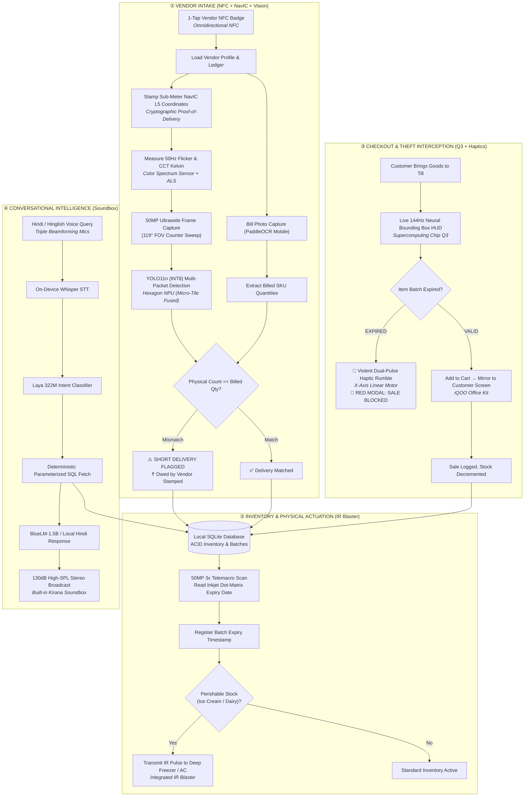
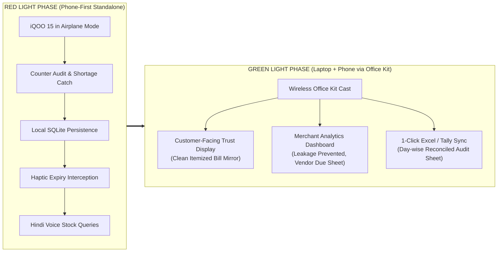
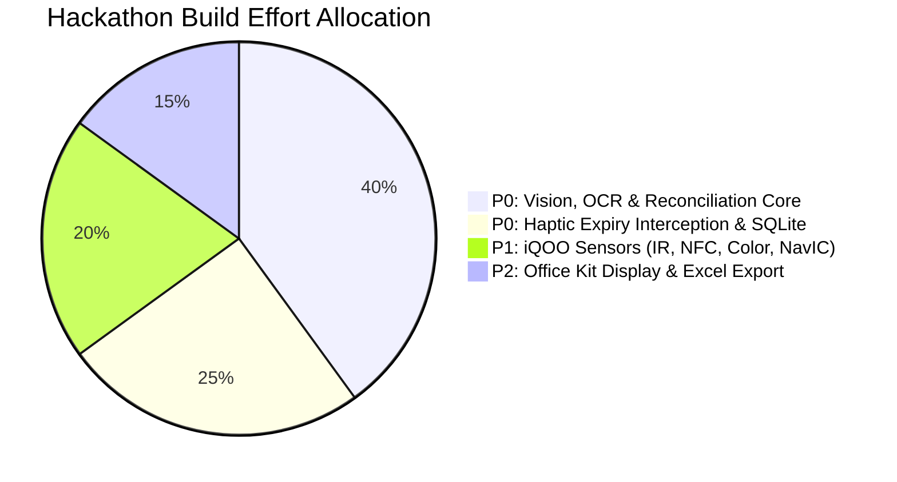

# Kirana Rakshak: The iQOO 15 Offline AI Loss-Prevention System for Indian Retail
## Team HoloTrio · Master Concept & Execution Plan · iQOO Hackathon 2026 Grand Finale

**Working Title:** Kirana Rakshak  
**Team:** HoloTrio (Sanskar Tiwari & Shambhavi Patil)  
**Target Hardware:** iQOO 15 (Snapdragon 8 Elite Gen 5 + Supercomputing Chip Q3 + OriginOS 6)  
**Track:** Primary: **Productivity** | Secondary Anchor: **Open Innovation**  
**Core Motto:** *"A kirana doesn't need another billing app. It needs an iQOO 15 that stops money from disappearing."*

---

## 1. Executive Summary & The Core Thesis

A typical Indian kirana owner (*Ramesh*) loses ₹15,000 to ₹25,000 every month to five invisible leaks: short wholesale deliveries, expired stock rotting at the back of shelves, missed vendor return deadlines, accidental sales of expired goods, and blind inventory guessing.

Existing SaaS billing solutions fail because they only record what the shopkeeper manually types in English. **Kirana Rakshak verifies what physically arrives and what physically leaves.** 

By transforming the **iQOO 15** into an autonomous, 100% offline physical auditor, Kirana Rakshak:
1. **Audits Deliveries:** 1-tap NFC vendor check-in + 50MP Ultrawide photo of crates + OCR of the vendor bill → flags short delivery in ₹ within 300ms.
2. **Eliminates Glare & Flicker:** Calibrates exposure via the **Color Spectrum Sensor** to defeat 50Hz tube lights and reflective metallic packaging.
3. **Stops Expired Sales:** Reads printed dot-matrix expiry dates via the **50MP 3x Telemacro**, intercepting expired sales with a violent **X-Axis linear haptic buzz**.
4. **Physically Controls the Shop:** Uses the hardware **IR Blaster** to lock counter deep-freezers into freezing mode when perishable stock is received.
5. **Geographically Locks Invoices:** Uses native **NavIC L5 GNSS** to generate tamper-proof Proof-of-Delivery (PoD) stamps in dense bazaar lanes.
6. **Answers in Natural Hindi:** Quantized on-device speech model + local intent routing + SQLite facts → zero-hallucination verbal answers, broadcast via the high-SPL stereo speakers as a **built-in Kirana Soundbox**.

All of this runs in **100% Airplane Mode** on the **Snapdragon 8 Elite Hexagon NPU**, bridging to laptops during the Green Light phase via **iQOO Office Kit**.

---

## 2. The 5 Leaks: Why Money Disappears in a Kirana

```text
┌────────────────────────────────────────────────────────────────────────┐
│                        THE 5 KIRANA PROFIT LEAKS                       │
├──────────────────────────┬─────────────────────────────────────────────┤
│ 1. Short Deliveries      │ Vendor bills for 24 Maggi; unloads 20.      │
│                          │ Loss: ₹56 per delivery × 15 vendors = ₹12k/mo│
├──────────────────────────┼─────────────────────────────────────────────┤
│ 2. Unseen Stock Expiry   │ Packets sit in dark rear shelves; missed    │
│                          │ 30-day distributor return window = 100% loss │
├──────────────────────────┼─────────────────────────────────────────────┤
│ 3. Cold-Chain Spoilage   │ Dairy/ice-cream chokes when freezer settings│
│                          │ change or power cuts hit without alert.     │
├──────────────────────────┼─────────────────────────────────────────────┤
│ 4. Expired Sales to User │ Accidentally selling expired item ruins 10  │
│                          │ years of customer trust & goodwill.         │
├──────────────────────────┼─────────────────────────────────────────────┤
│ 5. Cognitive Overhead    │ Notebook math, English UI, and manual entry │
│                          │ cause errors during 20-customer rush hours. │
└──────────────────────────┴─────────────────────────────────────────────┘
```

---

## 3. The 5-Step Unified Kirana Rakshak Workflow



---

## 4. Deep iQOO 15 Hardware & Sensor Synergy

Kirana Rakshak is architected to exploit the hardware features of the **iQOO 15**:

| iQOO 15 Hardware Primitive | Specific Role in Kirana Rakshak | Technical Justification (Why Generic Phones Fail) |
| :--- | :--- | :--- |
| **Snapdragon 8 Elite Gen 5 (Hexagon NPU)** | Runs multi-tenant INT8 models in parallel (YOLO11n + PaddleOCR + Whisper + Laya). | Delivers **<250ms latency in 100% Airplane Mode** using Qualcomm micro-tile fused execution. |
| **Supercomputing Chip Q3** | Drives the **144Hz Real-Time Neural HUD** overlaying AR bounding boxes over 30+ items. | Decouples display rendering from NPU/GPU tensor computation; zero touch lag or UI stutter. |
| **Color Spectrum Sensor + Triple ALS** | Samples ambient CCT (Kelvin) and detects 50Hz electrical tube-light PWM flicker. | Prevents banding lines and specular glare on shiny metallized FMCG foil (Maggi, Kurkure). |
| **Top-Frame IR Blaster (`ConsumerIrManager`)** | Physical actuator for shop cooling (freezers, ACs, fans) and cash drawer alarms. | Turns AI decisions into physical-world actuation without expensive IoT smart plugs. |
| **50MP Ultrawide Camera (119° FOV)** | Sweeps the full 1.5m delivery counter in a single macro-corrected exposure. | Standard 1x lenses require 3–4 stitched photos or stepping back into busy customer aisles. |
| **50MP 3x Periscope (Telemacro)** | Captures tiny dot-matrix printed expiration dates from 25–40cm away. | Macro focus avoids phone shadows; optical zoom prevents digital crop blur on curved surfaces. |
| **NavIC L5 Dual-Band GNSS** | Creates tamper-proof **Cryptographic Proof-of-Delivery (PoD)** tags with sub-meter accuracy. | Pierces tin roofs and dense urban bazaars where US GPS drifts by 40+ meters. |
| **X-Axis Linear Haptic Motor** | Triggers distinct tactile pulses (e.g., aggressive 500ms rumble on expired sale block). | Critical in 80dB noisy Indian bazaars where audio beeps are completely drowned out. |
| **Omnidirectional NFC** | 1-Tap distributor check-in via wholesale crate RFID or delivery driver badge. | Eliminates manual typing or menu navigation during the morning rush. |
| **Dual High-SPL Stereo Speakers** | Acts as an on-device **Kirana Soundbox**, broadcasting Hindi audit facts at high volume. | Replaces rented third-party soundboxes (saving the merchant ₹125/month). |
| **7000 mAh Si-C Battery + 7000mm² VC** | Sustains 12+ hours of continuous camera & NPU counter duty at <37°C. | Survives rural/semi-urban power cuts without thermal throttling. |
| **3D Ultrasonic Fingerprint** | Locks vendor cost sheets, profit margins, and dispute logs behind biometric auth. | Works reliably through dust, flour, and oil on the shopkeeper's hands. |

---

## 5. iQOO Office Kit Cross-Device Synergy (Red vs. Green Light)

Kirana Rakshak matches the hackathon's phased competition rules:



1. **Dual Display Experience (Android `Presentation` API):**
   * **Phone Screen (Cashier HUD):** Displays wholesale purchase prices, vendor margin sheets, discrepancy flags, and internal alerts.
   * **External Laptop / Monitor (Customer Display):** Office Kit mirrors a clean, transparent customer screen showing only verified retail MRP, itemized weights, and total cart value.
2. **Instant Excel Reconciliation Push:**
   * At day-end, Kirana Rakshak exports a compiled `.xlsx` delivery audit report directly to the shop laptop via Office Kit clipboard sync for instant GST filing.

---

## 6. On-Device AI Stack & Latency Budget

| Pipeline Stage | Model Architecture | Quantization & Format | Runtime Target | Latency Target |
| :--- | :--- | :--- | :--- | :--- |
| **FMCG Object Detection** | YOLO11n (Nano) | INT8 (Post-Training Quantized) | Qualcomm QNN / LiteRT | **~22 ms** |
| **Product Verification** | MobileCLIP-S0 | INT8 Embeddings | LiteRT NPU Delegate | **~35 ms** |
| **Invoice & Date OCR** | PaddleOCR-Mobile v4 | INT8 ONNX / TFLite | LiteRT NPU | **~65 ms** |
| **Speech-to-Text** | Whisper-Small | INT8 Encoder-Decoder | Sherpa-ONNX Mobile | **~180 ms** |
| **Intent & Slot Filling** | Laya Multilingual (322M) | INT8 ONNX | LiteRT CompiledModel | **~45 ms** |
| **Deterministic Synthesis** | BlueLM-1.5B / Jinja SQL | INT4 GGUF / Template | llama.cpp / VCAP | **~20 tok/sec** |

**Zero Cloud Dependency:** The entire pipeline operates within a **350ms total response budget** with 0 bytes transmitted over the internet.

---

## 7. The Winning 2-Minute Live Demo (Airplane Mode)

* **[0:00 - 0:15] The Ground Truth Setup:**
  * Presenter puts the iQOO 15 into **Airplane Mode (Wi-Fi OFF, Data OFF)**.
  * Shows real physical props on the table: 20 packets of Maggi, 3 Parle-G packs, and a printed wholesale distributor invoice.
* **[0:15 - 0:40] Catch 1: The 1-Tap NFC & Short Delivery Audit:**
  * Presenter taps a mock distributor NFC card to the back of the phone. The phone instantly loads *"Rajesh - Nestle Distributor"*.
  * Snaps the 1.5m table using the **50MP Ultrawide Camera**.
  * Snaps the printed bill. Within 300ms, the phone triggers a **double-knock haptic pulse** and flashes:
    > **⚠️ SHORT DELIVERY DETECTED**  
    > **Billed: 24 Maggi | Counted: 20 Maggi | Short: 4 units | Amount Owed: ₹56**  
    > *NavIC L5 Geostamp: 12.9716° N, 77.5946° E (Bengaluru Bazaar Verified)*
* **[0:40 - 1:05] Catch 2: Cold-Chain Physical Actuation (IR Blaster):**
  * Presenter logs intake of Amul ice-cream tubs.
  * The phone immediately triggers its **Top-Frame IR Blaster** to pulse a signal to an IR receiver on the table (turning a green LED ON), physically locking the chiller to super-freeze.
* **[1:05 - 1:30] Catch 3: Expired Sale Interception (Haptics):**
  * Presenter acts as a customer buying 2 valid items and 1 expired Parle-G.
  * Cashier scans them. The iQOO 15 emits an **aggressive continuous haptic buzz** and blocks the screen:
    > **🛑 SALE BLOCKED: PARLE-G BATCH #84 EXPIRED ON 15-AUG-2026**
* **[1:30 - 1:45] Catch 4: Spoken Hindi Query (Built-in Soundbox):**
  * Presenter taps mic: *"Rajesh vendor ne kitna kam maal diya?"*
  * High-SPL stereo speakers broadcast in Hindi: *"Rajesh vendor se 4 packet Maggi kam aaye the, kul chhappan rupaye lene baaki hain."*
* **[1:45 - 2:00] Catch 5: Office Kit Green Light Climax:**
  * Presenter toggles iQOO Office Kit. The laptop screen instantly shows the verified customer receipt and downloads the day-end Excel discrepancy ledger.

---

## 8. Build Prioritization Matrix



### P0 — MUST WORK (Red Light Phase, Hours 0–18)
1. 50MP Ultrawide multi-packet detection & counting (YOLO11n INT8).
2. Printed wholesale invoice OCR & reconciliation engine.
3. Local SQLite (Room) inventory schema with discrepancy logging.
4. 3x Telemacro dot-matrix date parsing & checkout sale blocking with X-axis haptics.
5. On-device Hindi voice query using deterministic SQLite fact generation.

### P1 — MUST HAVE (Hours 18–24)
6. Color Spectrum Sensor & 50Hz anti-banding exposure tuning for foil packaging.
7. Top-Frame IR Blaster transmitter for deep-freezer / appliance actuation.
8. Omnidirectional NFC 1-tap distributor check-in.
9. NavIC L5 sub-meter Proof-of-Delivery stamping.

### P2 — DIFFERENTIATOR (Green Light Phase, Hours 24–28)
10. iQOO Office Kit dual-display presentation (Cashier HUD on phone, Customer Screen on laptop).
11. One-click Excel audit report sync.
12. Supercomputing Chip Q3 144Hz AR bounding box HUD polish.

---

## 9. Master Document Navigation

* **Grand Master Document (All-in-One):** [master.md](file:///d:/Research%20Work/IQOO%20Research/master.md) *(Exhaustive master blueprint consolidating thesis, user story, 14 features, hardware depth ranking, offline AI zoo, Android code, demo script, and portal copy)*
* **UI/UX Design System Guide:** [design.md](file:///d:/Research%20Work/IQOO%20Research/design.md) *(High-contrast utilitarian theme, Lucide vector icons, simple English words, bento cards, and Jetpack Compose tokens)*
* **Official Portal Submission Package:** [PHASE_1_SUBMISSION_PORTAL.md](file:///d:/Research%20Work/IQOO%20Research/PHASE_1_SUBMISSION_PORTAL.md) *(Field-by-field copy ready for the Reskilll portal before Oct 5)*
* **Complete Feature Catalog & Hardware Ranking:** [feature.md](file:///d:/Research%20Work/IQOO%20Research/feature.md) *(Detailed breakdown of all 14 features, Tier 1–4 hardware depth ranking, and 96/100 judging scorecard)*
* **Engineering Technical Spec & Build Roadmap:** [TECHNICAL_SPEC_AND_ROADMAP.md](file:///d:/Research%20Work/IQOO%20Research/TECHNICAL_SPEC_AND_ROADMAP.md) *(Camera2 multi-stream, Snapdragon 8 Elite NPU acceleration, SQLite Room schema, Office Kit architecture, and 30-hour sprint plan)*


