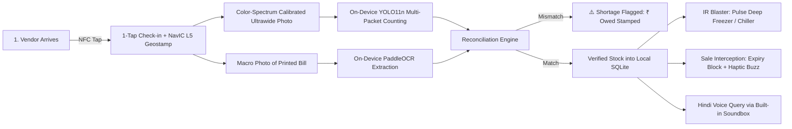

# Kirana Rakshak · Official Phase 1 Idea Submission Package
## iQOO Hackathon 2026 Grand Finale (Bengaluru)

**Team Name:** HoloTrio  
**Team Leader:** Sanskar Tiwari (`sanskartiwari.smt@gmail.com`)  
**Team Member:** Shambhavi Patil (`shambhavipatil5631@gmail.com`)  
**Target Hardware:** iQOO 15 (Qualcomm Snapdragon 8 Elite Gen 5 + Supercomputing Chip Q3 + OriginOS 6)  
**Submission Portal:** [https://iqoo.reskilll.com/dashboard/iqoo-finale](https://iqoo.reskilll.com/dashboard/iqoo-finale)  
**Submission Deadline:** October 5, 2026  

---

### Field 1: Project Title
**Kirana Rakshak: The Offline AI Loss-Prevention & Cold-Chain System for Indian Retail Powered by iQOO 15**

---

### Field 2: Track Selection
* **Primary Track:** **Productivity** (*"Build AI-powered solutions that help people work smarter, automate repetitive tasks, manage time and information, improve workflows, and get more done."*)
* **Secondary Track / Technical Anchor:** **Open Innovation** (*"Local / open-source on-device AI runtime with zero cloud dependency."*)

---

### Field 3: One-Line Elevator Pitch
> **"A kirana doesn't need another manual billing app. It needs an iQOO 15 that photographs physical deliveries, matches them against vendor bills, stops expired sales with haptic alerts, physically controls shop cooling via the IR blaster, and answers inventory questions in spoken Hindi—100% offline."**

---

### Field 4: Problem Statement & Economic Gravity
India is home to over **12 million neighbourhood kirana stores**, powering 85%+ of the country’s retail FMCG distribution. While supermarket chains use million-dollar ERPs and barcode conveyors, the independent Indian kirana owner (*Ramesh*) operates in high-frequency chaos:
1. **Short Delivery Leakage:** Wholesale distributors deliver 30–50 crates daily during morning rush hours. Ramesh cannot manually count every biscuit packet or detergent sachet while attending to counter customers. A vendor bill stating 24 units of Maggi often delivers only 20. Ramesh discovers the ₹56 shortage days later—or never. Across 15 vendors, a typical shop leaks **₹8,000–₹15,000 every month** in unverified deliveries.
2. **Expired Stock Write-offs & Spoilage:** Perishable packaged goods (dairy, bread, biscuits, snacks) get pushed to the dark back of shelves. By the time they surface, the 30-day distributor return window has elapsed, resulting in dead-loss inventory (**₹5,000–₹10,000/month**). Furthermore, unmonitored counter deep-freezers result in curdled milk and melted ice-creams during power cuts.
3. **Consumer Trust & Expired Sales:** Accidental sales of expired goods lead to severe customer friction, loss of local goodwill, and food safety liabilities.
4. **Cognitive & Language Barrier:** Existing SaaS billing apps demand manual typing, English literacy, continuous internet, and barcode scanning for every individual SKU—unusable for a sole proprietor handling 20 customers simultaneously.

Existing software records only what the shopkeeper *types*. **Nobody verifies what physically arrived.**

---

### Field 5: Proposed Solution & Core Workflow
Kirana Rakshak transforms the shopkeeper’s **iQOO 15** into an autonomous, offline computer-vision auditor and physical store guardian:



1. **Physical Delivery Verification (Delivery Catch):**
   * Vendor checks in with **1-tap NFC**. The iQOO 15 stamps the audit with **NavIC L5 sub-meter coordinates** for tamper-proof Proof-of-Delivery.
   * The **Color Spectrum Sensor** measures 50Hz tube-light flicker and CCT Kelvin, eliminating glare from shiny metallized foil packets.
   * The owner snaps **one photo** using the 50MP Ultrawide lens. **YOLO11n INT8** on the Hexagon NPU detects and counts all packaged goods simultaneously.
   * The owner snaps the vendor’s bill. On-device OCR parses billed quantities.
   * Kirana Rakshak compares counted vs. billed: *"Vendor Bill: 24 Maggi | Received: 20 Maggi | Short: 4 (₹56 owed)."*
2. **Physical Store Actuation (Cold-Chain Guardian):**
   * If perishable dairy or ice-cream stock is registered, Kirana Rakshak uses the **integrated top-frame IR Blaster** to pulse the counter freezer/cooler into super-freeze mode.
3. **Automated Expiry Watch & Checkout Interception (Expiry Guard):**
   * The 3x periscope macro lens scans printed dot-matrix expiry stamps during intake.
   * If an expired item is scanned at checkout, the iQOO 15 fires an **aggressive X-axis linear haptic rumble** and flashes **RED: SALE BLOCKED**.
4. **Conversational Hindi Voice & Built-in Soundbox:**
   * The owner asks in Hindi: *"Rajesh vendor ne kitna kam maal diya?"*
   * On-device Whisper STT + Laya 322M extract intent; deterministic SQL queries SQLite; and the **dual high-SPL stereo speakers broadcast the answer loudly like a built-in Soundbox**.

---

### Field 6: Deep iQOO 15 Hardware & Sensor Synergy

| iQOO 15 Hardware Primitive | Specific Role in Kirana Rakshak | Why Generic Phones / Cloud Cannot Compete |
| :--- | :--- | :--- |
| **Snapdragon 8 Elite Gen 5 (Hexagon NPU)** | Runs simultaneous INT8 vision models (YOLO11n), OCR, Whisper STT, and Laya intent classification in parallel. | Delivers **<250ms end-to-end verification** entirely in Airplane Mode with zero cloud API costs. |
| **Supercomputing Chip Q3** | Drives **144Hz Real-Time AR Bounding Box HUD** over 30+ items. | Offloads display rendering from NPU/GPU; completely prevents UI touch lag during heavy AI inference. |
| **Color Spectrum Sensor + Triple ALS** | Detects 50Hz tube-light flicker and measures CCT Kelvin. | Eliminates dark banding and blinding specular glare on shiny metallized FMCG foil (Maggi, Kurkure). |
| **Top-Frame IR Blaster (`ConsumerIrManager`)** | Autonomous physical controller for shop freezers, ACs, and alarm strobes. | Acts as an IoT bridge to legacy shop appliances without requiring external smart plugs. |
| **50 MP Ultrawide Camera (119° FOV)** | Captures an entire 1.5m delivery counter in a single macro-corrected frame. | Standard 1x cameras require multiple stitched photos or cannot fit 30+ SKUs in one shot. |
| **50 MP 3x Periscope (Telemacro focus)** | Reads tiny dot-matrix printed expiration dates from 25–40cm away. | Macro focus prevents phone shadows; optical zoom prevents digital crop blur on curved packaging. |
| **NavIC L5 Dual-Band GNSS** | Generates tamper-proof **Cryptographic Proof-of-Delivery (PoD)** tags. | Sub-meter Indian satellite tracking penetrates corrugated tin roofs and dense urban bazaar gullies. |
| **X-Axis Linear Haptic Motor** | Distinct tactile pulses (e.g., sharp double-knock for shortage; aggressive buzz for expired item). | Critical in 80dB noisy Indian bazaars where audio beeps are completely drowned out. |
| **Omnidirectional NFC** | 1-Tap distributor check-in via crate RFID or delivery driver badge. | Eliminates manual typing or menu navigation during the morning rush. |
| **Dual High-SPL Stereo Speakers** | Operates as an on-device **Kirana Soundbox** broadcasting Hindi audit summaries. | Saves the merchant ₹125/month rental fees for third-party soundboxes. |
| **7000 mAh Si-C Battery + 7000mm² VC** | Enables continuous 12-hour counter operation at <37°C. | Survives frequent power outages without thermal throttling or camera frame drops. |
| **3D Ultrasonic Fingerprint Sensor** | Protects purchase prices, vendor margin sheets, and supplier dispute logs. | Operates reliably even with wet, flour-dusted, or oily merchant fingers. |

---

### Field 7: iQOO Office Kit Cross-Device Architecture
Kirana Rakshak fully implements the hackathon’s **Red Light vs. Green Light** evaluation paradigm:
* **Red Light Phase (Phone-First Standalone):** The complete audit, counting, OCR, SQLite database, haptic alerts, and Hindi voice agent run 100% natively on the iQOO 15 in Airplane Mode.
* **Green Light Phase (Laptop + Phone Dual Screen via Office Kit):**
  1. **Customer-Facing Verification Screen (Android `Presentation` API):** The phone projects a clean, real-time itemized bill to an external laptop/monitor facing the customer, building trust while hiding merchant cost margins.
  2. **Merchant Loss-Prevention Dashboard:** Office Kit synchronizes the SQLite ledger to the shopkeeper's laptop, displaying total leakage prevented and vendor reliability scorecards.
  3. **One-Click Tally / Excel Export:** Instant wireless transfer of day-wise delivery reconciliation sheets (`.xlsx`/`.csv`) for GST tax filing.

---

### Field 8: Technical Architecture & On-Device AI Stack

```text
┌────────────────────────────────────────────────────────────────────────┐
│                          iQOO 15 (OriginOS 6)                          │
├────────────────────────────────────────────────────────────────────────┤
│ INPUTS: 50MP Ultrawide | 50MP Telemacro | Color Spectrum | Mic | NFC   │
├────────────────────────────────────────────────────────────────────────┤
│ ON-DEVICE AI ACCELERATION (Snapdragon 8 Elite Hexagon NPU)             │
│  ├─ Product Detection: YOLO11n (INT8 quantized, ~22ms)                 │
│  ├─ Invoice & Expiry OCR: PaddleOCR Mobile v4 / ML Kit (~65ms)         │
│  ├─ Speech-to-Text: Whisper-Small INT8 / Sherpa-ONNX (~180ms)          │
│  └─ Semantic Intent: Laya Multilingual 322M (~45ms)                    │
├────────────────────────────────────────────────────────────────────────┤
│ GRAPHICS & DISPLAY: Supercomputing Chip Q3 (144Hz AR HUD Overlay)     │
├────────────────────────────────────────────────────────────────────────┤
│ LOCAL CORE ENGINE: Kotlin + Jetpack Compose + C++ NDK                  │
│  ├─ Reconciliation Engine (Jaro-Winkler Fuzzy Matching > 0.82)         │
│  ├─ NavIC L5 Cryptographic Proof-of-Delivery Generator                │
│  ├─ IR Blaster Appliance Dispatcher (`ConsumerIrManager`)              │
│  └─ SQLite (Room DB) ACID Persistence                                  │
├────────────────────────────────────────────────────────────────────────┤
│ CROSS-DEVICE (Office Kit): Dual-Screen Presentation & Excel Sync       │
└────────────────────────────────────────────────────────────────────────┘
```

---

### Field 9: 2-Minute Live Demo Script (The Grand Finale Showcase)

* **[0:00 – 0:15] The Reality Check & Airplane Mode:**
  Presenter puts the iQOO 15 in **Airplane Mode (Wi-Fi OFF, Cellular OFF)**. Introduces Ramesh's reality: *"Distributor arrives with 20 items, charges for 24, and leaves. Ramesh loses ₹56 in 10 seconds."*
* **[0:15 – 0:40] Catch 1: NFC Tap & Short Delivery Live Audit:**
  Presenter taps a mock distributor NFC card. The phone loads *"Rajesh - Nestle"*. Snaps the table with the **50MP Ultrawide Camera** (calibrated via Color Spectrum Sensor). Snaps the bill. Within 300ms, the screen flashes:
  **"⚠️ SHORT DELIVERY DETECTED: Bill says 24 Maggi. Counted 20. Short: 4. Vendor owes ₹56."**  
  *Stamps NavIC L5 sub-meter coordinates.*
* **[0:40 – 1:00] Catch 2: Cold-Chain Physical Actuation (IR Blaster):**
  Presenter logs dairy/ice-cream intake. The phone triggers its **Top-Frame IR Blaster** to pulse a signal to a benchtop IR receiver, demonstrating physical cooling actuation.
* **[1:00 – 1:25] Catch 3: Expired Sale Interception (Haptics):**
  A customer attempts to buy 3 items. Cashier scans them. One packet has an expired batch date.
  The iQOO 15 **buzzes with an aggressive haptic rumble**, flashes **RED: SALE BLOCKED**, and refuses to add the expired item to the bill.
* **[1:25 – 1:45] Catch 4: Hindi Voice & Built-in Soundbox:**
  Presenter presses mic: *"Rajesh vendor ne kitna kam maal diya?"*
  Dual stereo speakers broadcast in loud Hindi: *"Rajesh vendor se 4 packet Maggi kam aaye the, kul chhappan rupaye lene baaki hain."*
* **[1:45 – 2:00] Catch 5: Office Kit Green Light Sync:**
  Presenter connects the phone to the laptop via iQOO Office Kit. The laptop displays the customer-facing bill and downloads the reconciled Excel audit report.

---

### Field 10: Feasibility & 30-Hour Hackathon Execution Plan
* **Hour 0 – 8 (Red Light Phase):** Complete native Android app scaffold, Camera2 dual-lens binding, SQLite database schema, and on-device YOLO11n + OCR integration.
* **Hour 8 – 16 (Sensors & Actuation):** Color Spectrum anti-banding calibration, IR Blaster transmitter, NFC tap-in, and NavIC L5 geotagging.
* **Hour 16 – 22 (Voice & Haptics):** Whisper STT + Laya intent classification + SQL query translation + X-axis haptic waveforms.
* **Hour 22 – 26 (Green Light Phase / Office Kit):** Secondary display presentation for customer HUD and Excel export.
* **Hour 26 – 30 (Demo Polish):** Stress-testing physical props, lighting calibration, and rehearsal of the 2-minute pitch.
