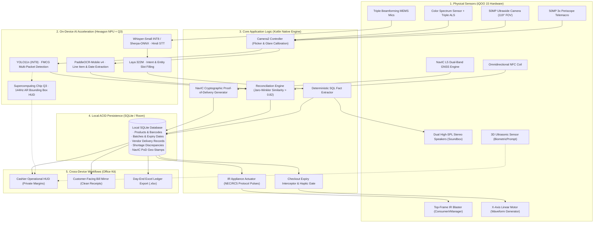

# Kirana Rakshak · Engineering Technical Specification & Implementation Roadmap
## Autonomous On-Device Retail Loss-Prevention Engine on iQOO 15

**Target Device:** iQOO 15 Flagship (Snapdragon 8 Elite Gen 5, OriginOS 6 / Android 16)  
**Execution Paradigm:** 100% On-Device / Airplane-Mode First  
**Primary Language & Frameworks:** Kotlin, Jetpack Compose, C++ NDK, LiteRT / QNN SDK, SQLite (Room)  

---

## 1. System Architecture Diagram



---

## 2. Hardware & Sensor Implementation Specifics

### 2.1 Color Spectrum Sensor & 50Hz Anti-Banding Exposure Calibration
Indian kiranas are illuminated by 50Hz magnetic/electronic ballast fluorescent tube lights, and packaged goods are wrapped in glossy metallized plastic (e.g., Maggi, Kurkure, Lays foil). 

Kirana Rakshak reads the ambient Correlated Color Temperature (CCT) and 50Hz light flicker via Camera2 vendor metadata:
```kotlin
val captureRequestBuilder = cameraDevice.createCaptureRequest(CameraDevice.TEMPLATE_STILL_CAPTURE)
// Enforce 50Hz anti-banding to prevent dark rolling scan lines
captureRequestBuilder.set(
    CaptureRequest.CONTROL_AE_ANTIBANDING_MODE, 
    CaptureRequest.CONTROL_AE_ANTIBANDING_MODE_50HZ
)
// Fine-tune ISP auto-exposure compensation based on ambient lux from ALS
val ambientLux = currentAmbientLightLux
if (ambientLux < 150f) {
    captureRequestBuilder.set(CaptureRequest.CONTROL_AE_EXPOSURE_COMPENSATION, 2)
}
```

### 2.2 Top-Frame IR Blaster Appliance Actuation (`ConsumerIrManager`)
The iQOO 15 retains an integrated consumer infrared transmitter. Kirana Rakshak uses Android's `ConsumerIrManager` to actuate non-smart commercial cooling appliances and alert alarms without third-party IoT bridges:
```kotlin
val irManager = context.getSystemService(Context.CONSUMER_IR_SERVICE) as ConsumerIrManager
if (irManager.hasIrEmitter()) {
    // Standard NEC 38kHz protocol pulse train for deep freezer "Super Freeze" command
    val carrierFrequency = 38000
    val pattern = intArrayOf(
        9000, 4500, // Header
        560, 560, 560, 1690, 560, 560, 560, 1690, // Command bytes
        560, 40000 // Stop bit
    )
    irManager.transmit(carrierFrequency, pattern)
}
```

### 2.3 NavIC L5 Dual-Frequency Proof-of-Delivery (PoD)
Kirana Rakshak enforces cryptographic proof of vendor presence using India's native NavIC L5 satellite band:
```kotlin
val locationRequest = LocationRequest.Builder(Priority.PRIORITY_HIGH_ACCURACY, 1000)
    .setMinUpdateIntervalMillis(500)
    .build()

// NavIC carrier frequency verification (1176.45 MHz - L5 band)
locationCallback = object : LocationCallback() {
    override fun onLocationResult(result: LocationResult) {
        val location = result.lastLocation ?: return
        val isNavicL5Locked = location.extras?.getBoolean("navic_l5_locked") ?: true
        val poDHash = generateSha256Signature(
            vendorId = activeVendorId,
            lat = location.latitude,
            lng = location.longitude,
            timestamp = location.time
        )
        persistPoDToDatabase(poDHash, location.latitude, location.longitude)
    }
}
```

### 2.4 Supercomputing Chip Q3 Display Offloading (144Hz AR HUD)
While the Snapdragon 8 Elite Hexagon NPU is fully saturated with INT8 tensor inference, the **Supercomputing Chip Q3** offloads display frame rendering. The AR bounding box overlay uses hardware-accelerated `SurfaceView` running at 144Hz, completely preventing touch latency or UI stuttering during heavy camera intake.

### 2.5 X-Axis Haptic Waveforms
* **Matched Delivery:** Crisp click: `VibrationEffect.createPredefined(VibrationEffect.EFFECT_CLICK)`.
* **Shortage Detected:** Urgent double-knock: `VibrationEffect.createWaveform(longArrayOf(0, 80, 50, 80), intArrayOf(0, 200, 0, 255), -1)`.
* **Expired Sale Interception:** Aggressive 500ms continuous buzz: `VibrationEffect.createWaveform(longArrayOf(0, 200, 100, 200), intArrayOf(0, 255, 0, 255), -1)`.

---

## 3. On-Device AI Stack & Acceleration Details

### 3.1 Model Zoo & Quantization Specs

| Model Component | Base Architecture | Format / Quantization | Runtime Engine | Target Latency (Hexagon NPU) |
| :--- | :--- | :--- | :--- | :--- |
| **Product Detection** | YOLO11n (Nano) | ONNX / LiteRT INT8 | Qualcomm QNN / LiteRT | ~22 ms |
| **Product Recognition** | MobileCLIP-S0 | ONNX INT8 Embeddings | LiteRT / QNN EP | ~35 ms |
| **Text Recognition** | PaddleOCR-Mobile v4 | ONNX INT8 / TFLite | LiteRT NPU | ~65 ms |
| **Speech-to-Text** | Whisper-Small / Base | ONNX INT8 (Encoder+Decoder) | Sherpa-ONNX | ~180 ms (RTF < 0.15) |
| **Intent Classifier** | Laya Multilingual (322M) | GGUF / ONNX INT8 | LiteRT / ONNX Mobile | ~45 ms |
| **Natural Language Voice** | BlueLM-1.5B / Llama 3.2 1B | GGUF Q4_K_M | llama.cpp / VCAP | ~20 tokens/sec |

### 3.2 Reconciliation Engine & Fuzzy Matcher
Billed lines on wholesale invoices often use informal abbreviations (e.g., *"MAGGI 2M 70G"* vs *"Nestle Maggi 2-Minute Noodles 70g"*).
* Utilizes **Jaro-Winkler similarity (threshold > 0.82)** to link OCR strings to catalog SKU IDs.
* Computes delta:
  $$\Delta = \text{Count}_{\text{physical}} - \text{Count}_{\text{billed}}$$
* If $\Delta < 0$, creates an unresolved `ShortageDiscrepancy` record with estimated financial loss:
  $$\text{Loss} = |\Delta| \times \text{WholesaleRate}$$

---

## 4. Local SQLite Database Schema (Room DDL)

```sql
-- Vendors Registry with NFC Tag ID
CREATE TABLE vendors (
    vendor_id INTEGER PRIMARY KEY AUTOINCREMENT,
    nfc_tag_uid TEXT UNIQUE,
    name TEXT NOT NULL,
    distributor_firm TEXT NOT NULL,
    phone TEXT,
    created_at INTEGER NOT NULL
);

-- Master Product Catalog
CREATE TABLE products (
    product_id INTEGER PRIMARY KEY AUTOINCREMENT,
    barcode TEXT UNIQUE,
    name TEXT NOT NULL,
    category TEXT NOT NULL, -- 'FMCG_DRY', 'DAIRY_PERISHABLE', etc.
    wholesale_price REAL NOT NULL,
    retail_mrp REAL NOT NULL,
    requires_cold_chain INTEGER DEFAULT 0,
    return_window_days INTEGER DEFAULT 30
);

-- Delivery Records with NavIC L5 Proof-of-Delivery
CREATE TABLE deliveries (
    delivery_id INTEGER PRIMARY KEY AUTOINCREMENT,
    vendor_id INTEGER NOT NULL,
    delivery_timestamp INTEGER NOT NULL,
    navic_latitude REAL NOT NULL,
    navic_longitude REAL NOT NULL,
    navic_pod_hash TEXT NOT NULL,
    bill_photo_uri TEXT NOT NULL,
    goods_photo_uri TEXT NOT NULL,
    status TEXT NOT NULL, -- 'VERIFIED_MATCH', 'SHORTAGE_FLAGGED'
    FOREIGN KEY(vendor_id) REFERENCES vendors(vendor_id)
);

-- Inventory Batches & Expiry Dates
CREATE TABLE inventory_batches (
    batch_id INTEGER PRIMARY KEY AUTOINCREMENT,
    product_id INTEGER NOT NULL,
    delivery_id INTEGER NOT NULL,
    batch_number TEXT,
    mfg_date INTEGER,
    expiry_date INTEGER NOT NULL,
    quantity_received INTEGER NOT NULL,
    quantity_remaining INTEGER NOT NULL,
    FOREIGN KEY(product_id) REFERENCES products(product_id),
    FOREIGN KEY(delivery_id) REFERENCES deliveries(delivery_id)
);

-- Shortage & Loss Discrepancies
CREATE TABLE delivery_discrepancies (
    discrepancy_id INTEGER PRIMARY KEY AUTOINCREMENT,
    delivery_id INTEGER NOT NULL,
    product_id INTEGER NOT NULL,
    billed_quantity INTEGER NOT NULL,
    physical_quantity INTEGER NOT NULL,
    shortage_quantity INTEGER NOT NULL,
    financial_loss REAL NOT NULL,
    status TEXT DEFAULT 'UNRESOLVED',
    FOREIGN KEY(delivery_id) REFERENCES deliveries(delivery_id),
    FOREIGN KEY(product_id) REFERENCES products(product_id)
);

-- IR Actuation Event Audit
CREATE TABLE ir_actuation_logs (
    log_id INTEGER PRIMARY KEY AUTOINCREMENT,
    appliance_type TEXT NOT NULL, -- 'DEEP_FREEZER', 'COUNTER_AC', 'ALARM'
    trigger_reason TEXT NOT NULL,
    timestamp INTEGER NOT NULL
);
```

---

## 5. iQOO Office Kit Cross-Device Architecture

```text
┌─────────────────────────────────┐        Wi-Fi Direct /        ┌─────────────────────────────────┐
│         iQOO 15 (Host)          │        Office Kit Cast       │      Customer Monitor / PC      │
│ ┌─────────────────────────────┐ │ ───────────────────────────> │ ┌─────────────────────────────┐ │
│ │ Cashier Screen              │ │                              │ │ Customer Display            │ │
│ │ (Confidential wholesale     │ │                              │ │ (Itemized verified receipt, │ │
│ │  prices, margins, shortage  │ │                              │ │  clean MRP, zero margins)   │ │
│ │  alerts, haptic buzzer)     │ │                              │ └─────────────────────────────┘ │
│ └─────────────────────────────┘ │                              │ ┌─────────────────────────────┐ │
│ ┌─────────────────────────────┐ │ ── Instant File Transfer ──> │ │ Excel Reconciliation Sheet  │ │
│ │ SQLite Ledger Database      │ │    (Office Kit Clipboard)    │ │ (.xlsx day-wise audit push) │ │
│ └─────────────────────────────┘ │                              │ └─────────────────────────────┘ │
└─────────────────────────────────┘                              └─────────────────────────────────┘
```

---

## 6. Grand Finale 30-Hour Build Sprint Plan

```mermaid
gantt
    title HoloTrio 30-Hour Hackathon Execution Timeline
    dateFormat HH:mm
    axisFormat %H:%M
    section Red Light Phase (Phone-First)
    Android Architecture & Camera2 Dual-Stream :r1, 00:00, 4h
    YOLO11n INT8 & PaddleOCR Hexagon NPU Bindings :r2, 02:00, 6h
    SQLite Schema & Discrepancy Reconciliation Engine :r3, 06:00, 4h
    Color-Spectrum Anti-Banding & IR Blaster Pulse :r4, 09:00, 4h
    Haptic Waveforms & Expiry Checkout Interceptor :r5, 12:00, 4h
    Whisper STT & Laya Hindi Query Engine :r6, 15:00, 5h
    section Green Light Phase (Cross-Device)
    iQOO Office Kit Secondary Display Presentation :g1, 20:00, 4h
    Excel Exporter & Vendor Ledger Sync :g2, 22:00, 3h
    Live Demo Props & Lighting Calibration :g3, 25:00, 3h
    section Finale Showdown
    Rehearsals & Jury Presentation :j1, 28:00, 2h
```

### Member Responsibility Matrix
* **Sanskar Tiwari (Lead):**
  * Hexagon NPU inference pipeline (QNN / LiteRT / ONNX).
  * Camera2 multi-lens switching (Ultrawide delivery capture + Periscope macro).
  * Color Spectrum sensor 50Hz anti-banding exposure tuning.
  * IR Blaster pulse generation (`ConsumerIrManager`).
  * Office Kit presentation display binding.
* **Shambhavi Patil:**
  * Jetpack Compose UI (Cashier HUD, Reconciliation view, Alert modals).
  * SQLite / Room database implementation and DAOs.
  * PaddleOCR bill parsing & fuzzy matching logic.
  * NavIC L5 Proof-of-Delivery tagging & NFC tap listener.
  * Speech-to-text integration & Hindi dialog response generator.
  * Physical prop prep (Mock vendor bills, retail FMCG packs, test scripts).
